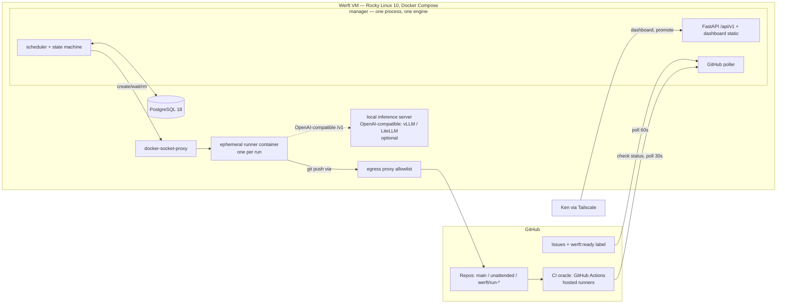

# Werft — System Architecture

**Status:** Groundwork specification, v1.3 (2026-07-20). This document is the buildable blueprint for Werft. It was produced by a multi-agent design process (7 parallel subsystem designs, each adversarially critiqued, then reconciled, then verified by 4 independent lenses); revised to v1.1 after a first independent external review (oracle-mutability gap §8.2/§13, Docker-wait contradiction §6.1, installation-token TTL bug §6.6); revised to v1.2 after a second independent verification ([docs/lineage/architecture-verification.md](docs/lineage/architecture-verification.md), verdict "buildable with fixes", 5/5 doctrine PASS) whose two majors — stale footnote-² annotations on the `awaiting_ci/merging → failed` cells and a stale `docker wait` completion-authority phrase in §6.4 — are fixed below and locked in by `tests/architecture_spec.test.mjs`; and revised to **v1.3 after a 2026/2027-currency-and-completeness audit** ([docs/lineage/architecture-2026-currency-audit.md](docs/lineage/architecture-2026-currency-audit.md), 7 web-researched dimensions + 3 adversarial analysis passes + 14 fact-checks). The prior passes hardened the *internal machinery* (state machine, schema, merge logic) to a high standard; the currency audit found the residual gaps clustered in the **operating envelope** — provider Terms-of-Service, real-money economics, covert network channels (DNS), GitHub product semantics in the exact directions this design leans, and one operator's finite attention — plus a handful of stack rows that had gone a notch stale. Those findings are applied throughout and summarized in §15. The doctrine in [README.md](README.md) governs; where this document and the doctrine conflict, the doctrine wins and this document has a bug.

**Scale target:** one operator (Ken), one dedicated Rocky Linux 10 VM, single-digit projects, tens of runs per day. Every component below justifies its operational cost to exactly one person. *Modular means enforced internal boundaries, not distributed systems.*

---

## 1. System overview



The flow of one run, end to end:

1. Ken labels a GitHub issue `werft:ready`. The manager's poller sees it (≤60 s) and inserts a `runs` row (`queued`). This is the **only** intake path (doctrine #5).
2. The dispatcher resolves a provider chain from `routing.yaml` and claims the run **and** its quota reservation in one transaction (`SELECT … FOR UPDATE SKIP LOCKED` + the §7.2 guarded insert — a run is never `claimed` without quota in hand), creates branch `werft/run-<id>` off `unattended`, and launches one ephemeral runner container for the first open provider in the chain.
3. Inside the container, a provider CLI (Claude Code / Codex / Kimi / Aider→local OpenAI-compatible endpoint) works the issue, commits, and pushes the branch. The adapter writes `result.json` and exits. Exit code + `result.json` are the **only** completion signals.
4. The manager opens a PR `werft/run-<id> → unattended`. GitHub Actions runs the project's `werft-oracle` workflow. Branch protection requires the branch to be **up to date with `unattended`**, so green checks always describe the merged result.
5. On green, the manager squash-merges (serialized, one merge at a time per project). On red, Werft retries with a **fresh dispatch** while the attempt budget lasts; a spent budget or a merge conflict parks the run for Ken. This satisfies doctrine #1 by its letter and intent: red work itself never merges — a retry is a brand-new attempt from a clean branch, and parking is automation's terminal outcome for red. **No LLM opinion exists anywhere in this path.**
6. When Ken decides, he clicks **Promote** in the dashboard: Werft opens a batch PR `unattended → main`, the same oracle re-runs against `main`, and Ken performs the human merge. A sync-back PR `main → unattended` follows every push to `main`, so the branches can never silently drift (v1 drifted 532 commits).

---

## 2. Technology stack (pinned July 2026, currency-reviewed 2026-07-20)

| Layer | Choice | Version | Rejected alternative (one line) |
|---|---|---|---|
| OS | **Rocky Linux 10**, SELinux **enforcing** | 10.x (10.2 as of July 2026) | Rocky 9: general support ends 2027-05-31 (<1 y after a mid-2026 go-live) — a greenfield build should start on 10 (support to 2030/2035). Verify the host/hypervisor exposes an **x86-64-v3** vCPU (Rocky 10's raised baseline; default `qemu64` fails it) — the one provisioning gotcha (§10.8). Toggling SELinux permissive remains a forbidden runbook action, not a fix |
| Containers | Docker CE + Compose plugin, rootful | **≥ 26.x** (past CVE-2024-29018; current stable) | Rootless/Podman: UID-remap friction without proportionate gain — the VM is the declared blast-radius boundary. **CONSIDER `userns-remap`** (§13) — keeps rootful Docker but remaps container UID 0 to an unprivileged host UID, so an escape ≠ VM root; deferred pending a §11 prototype because bind-mount ownership must account for the subuid offset |
| Database | PostgreSQL | **18.x**, latest minor (18.4 as of July 2026), `uuidv7()` built-in | PG 17: would need an extension for UUIDv7; 19 is still beta. **Image digest-pinned and mounted at `/var/lib/postgresql`, never the pre-18 `.../data` path** — the `postgres:18-alpine` entrypoint can silently re-init an empty DB on the old mount (§10.1/§10.6) |
| Manager language | Python | **3.14** | 3.13: valid but drops to security-only maintenance ≈Oct 2026 — a service shipping H2-2026 would enter security-only almost immediately; 3.14 keeps a full-bugfix runway into ~2027 and the async stack (FastAPI/uvicorn/asyncpg) already supports it (v1.2's "no feature justifies the floor" misframed the axis — it is support runway, not features) |
| Dependency management | **uv** + committed `uv.lock` (hash-verified) | current | Bare `pip`/`requirements.txt`: no hash lock — inconsistent with this spec's pin-everything discipline. Governance note (§13): OpenAI acquired Astral (uv/Ruff/ty) Mar 2026, so the toolchain and the Codex provider now share an owner |
| Web framework | FastAPI + uvicorn (1 worker) | 0.136.x | Second uvicorn worker would mean two schedulers — forbidden by design |
| ORM / migrations | SQLAlchemy 2 (async, asyncpg) + Alembic | 2.0.51+ | Raw SQL everywhere: loses typed models; Alembic is the only schema mechanism. (Stay on 2.0.x, not 2.1-beta; at 2.1 GA `sqlalchemy[asyncio]` becomes needed as greenlet turns optional) |
| Validation | Pydantic v2 (+ pydantic-settings) | 2.11+ | — (no v3 exists; avoid the `pydantic.v1` shim) |
| Boundary enforcement | import-linter (CI-gated) | current | Code-review convention: exactly how v1 accreted three engines |
| Logging | structlog → JSON lines | current | OpenTelemetry/tracing: no consumer at this scale — cut |
| HTTP client | httpx (GitHub API, Docker Engine API, alerts) | **pinned exact; monitored** | aiodocker: thinly maintained; we drive Docker's REST API directly via a ~200-line typed wrapper. **Governance flag (§13):** httpx's last stable is 0.28.1 (Dec 2024) and its maintainer closed all `encode/httpx` issues/discussions (Feb 2026) — no visible security-response path; keep aiohttp in view as the async fallback |
| Dashboard | Svelte 5 + Vite + Tailwind, static build served by the manager | current (pin exact Vite/Node) | Separate frontend server: one more service for zero benefit |
| Runner toolchains | pinned per language in `runners/versions.yaml`, incl. **Node LTS** (e.g. 24) for the dashboard build and JS/TS targets | pinned, hand-bumped | Unpinned toolchains: reproducibility gap inconsistent with the CLI-version discipline |
| Local inference (overflow tier) | coding CLI (Aider) → a self-hosted **OpenAI-compatible** endpoint: **vLLM** (recommended, GPU) · optionally **LiteLLM** in front as a unifying gateway · Ollama for CPU/dev | current | Hardcoding one engine: the contract is the OpenAI `/v1` API, not a specific server — see doctrine #3 and §6.5. CPU-only viability is limited (§10.4) |
| Backup | pg_dump + restic (offsite) | current | borg/borgmatic: more moving parts than restic's single binary |
| Alerts | ntfy (hosted, private topic) + optional Telegram | — | Self-hosted ntfy: one more service to run |
| CI (oracle *and* Werft's own CI) | GitHub Actions, GitHub-hosted runners | — | Self-hosted Woodpecker/Gitea: puts semi-untrusted execution on the manager's VM and adds a second CI engine to operate solo |

**There is no Redis, no Celery, no message broker, no Prometheus/Grafana/Loki, no Kubernetes.** Postgres is the queue (SKIP LOCKED), the event bus (LISTEN/NOTIFY), and the metrics store (SQL views). One stateful service.

---

## 3. Repository layout

```
werft/
├── ARCHITECTURE.md            # this document
├── README.md                  # doctrine — governs everything
├── docs/lineage/v1-verdict.md
├── manager/                   # the single Python service
│   └── werft/
│       ├── domain/            #  pure types, state machine, error taxonomy — zero I/O
│       ├── db/                #  engine, ORM models, repositories, Alembic env
│       ├── config/            #  Settings (env), RoutingTable (YAML), single load path
│       ├── contracts/         #  Pydantic models for task.json / result.json — shared with runner
│       ├── providers/         #  4 adapter *specs* (argv/env builders, outcome classifiers)
│       ├── routing/           #  resolve_chain + decide_dispatch (pure)
│       ├── quota/             #  ledger, reservation, windows
│       ├── runner/            #  Docker Engine API wrapper, container lifecycle
│       ├── github/            #  App auth, poller, PR/merge/promotion operations
│       ├── orchestrator/      #  scheduler loop, advance(), reconciliation — THE engine
│       ├── observe/           #  run_events, SSE fan-out, alerts, metrics views
│       ├── api/               #  FastAPI routers, auth, dashboard static mount
│       ├── cli/               #  werftctl: drain/undrain, onboard, doctor — talks ONLY to the API
│       └── app.py             #  composition root, lifespan, signal handling
├── runners/                   # container images
│   ├── base/Dockerfile        # rocky10, non-root uid 10000, git, toolchains (Node LTS pinned)
│   ├── claude/ codex/ kimi/ local/        # FROM base + one pinned CLI each (local = Aider → OpenAI-compatible /v1)
│   ├── adapter/               # werft_adapter runtime (Python 3.14, shares werft.contracts)
│   └── versions.yaml          # pinned CLI versions — bumped only by hand
├── dashboard/                 # Svelte 5 app → static build baked into manager image
├── deploy/
│   ├── docker-compose.yml
│   ├── install.sh             # idempotent first-boot bootstrap
│   ├── routing.example.yaml
│   └── systemd/               # werft-backup.timer, werft-watchdog.timer, werft-log-gc.timer
└── tests/                     # + import-linter contract, state-machine equivalence test
```

**Module dependency contract** (enforced by import-linter in CI; violations fail the build):

```
app → api → orchestrator → {routing | quota | runner | github | observe} → providers → {config | db | contracts} → domain
```

The five middle modules are mutually independent (may not import each other). Nothing imports `api`. `domain` imports nothing. This is the mechanical guarantee that a second engine cannot accrete unnoticed.

---

## 4. Domain model & persistence

### 4.1 Principles

- **One writer.** Only the manager process holds a Postgres connection string. Runners are DB-blind: file in (`task.json`), files out (`result.json`, log), exit code. This kills v1's "two engines, one DB file" at the root.
- **`runs` is the queue, the state, and the row.** No separate work-items/tasks/jobs tables — v1 had four overlapping ones.
- **Typed columns for anything queried.** JSONB only for genuinely opaque display payloads.
- **Transitions enforced in the database** (transition table + trigger) *and* mirrored in `domain` as a pure Python table. A contract test asserts the two are identical; the DB is authoritative.

### 4.2 Run state machine

```
                    ┌──────────────────────────────────────────────────┐
queued ──► claimed ──► running ──► awaiting_ci ──► merging ──► merged ✓│
  ▲ ▲ │       │            │            │  ▲          │                │
  │ │ │       │(lease¹,    │(attempt    │  └──────────┘ base moved ⁵   │
  │ │ │       │ deadline²) │ ended)     │(ci red ³/⁴)  │(conflict ⁶)   │
  │ │ │       ▼            ▼            ▼              ▼               │
  │ │ └► parked ◄────── failed ────► parked        parked              │
  │ │      │ ▲            │  │                                         │
  │ │      ▼ │            ▼  └──► queued ⁷                             │
  │ │   (human ⁹)   blocked_quota ──► queued                           │
  │ └───────────────────┘ (all providers exhausted, wake on reset)     │
  └── canceled ✓ ◄── any non-terminal state (human)                    │
```

**States:** `queued, claimed, running, awaiting_ci, merging, blocked_quota, failed, parked, merged, canceled`.
**Terminal:** `merged`, `canceled` only. `parked` is *not* terminal — a human can always requeue it (v1's design review caught "terminal parked + a retry button" as a contradiction; here it is resolved by fiat: parked runs are requeueable).

**Complete legal-transition table** (this exact set is inserted into `run_status_transitions`, mirrored in `domain.TRANSITIONS`, and drawn above — the adversarial reviews of both the draft *and* this document found prose flows missing from the table, so completeness here is load-bearing and re-verified below against every flow in §5.3/§7/§8):

| from \ to | queued | claimed | running | awaiting_ci | merging | blocked_quota | failed | parked | merged | canceled |
|---|---|---|---|---|---|---|---|---|---|---|
| queued | | ✓ | | | | ✓ᵃ | | ✓ᵇ | | ✓ |
| claimed | ✓¹ | | ✓ | | | | ✓² | | | ✓ |
| running | | | | ✓ | | | ✓ | | | ✓ |
| awaiting_ci | ✓³ | | | | ✓ | | ✓¹⁰ | ✓⁴ | | ✓ |
| merging | | | | ✓⁵ | | | ✓¹⁰ | ✓⁶ | ✓ | ✓ |
| blocked_quota | ✓ | | | | | | | | | ✓ |
| failed | ✓⁷ | | | | | ✓ᵃ | | ✓⁸ | | ✓ |
| parked | ✓⁹ | | | | | | | | | ✓ |

¹ lease expired before container start; a `running` lease expiry (container vanished with no die event) uses the existing `running → failed` edge · ² hard-deadline sweep — bounds **agent execution only** (`claimed, running`); the deadline is set at each claim and cleared on every exit from those states, so CI queues, quota waits, and human inboxes are never force-failed. `awaiting_ci`/`merging` are governed by the separate `WERFT_CI_WAIT_TIMEOUT` (6 h) whose expiry parks via the existing ⁴/⁶ edges with reason `ci_timeout` — GitHub's latency never burns an agent retry · ³ CI red with retry budget left → fresh dispatch (red work never merges; see §1 step 5) · ⁴ CI red, budget spent · ⁵ base branch moved; branch re-updated, checks must re-run — **a rebased merge can never land without fresh green CI** · ⁶ merge conflict → human · ⁷ retry with backoff (`next_attempt_at`) · ⁸ chain-cycle budget exhausted, or a `PermanentError` arriving via `failed` (no retry — §5.3) · ⁹ human requeue · ¹⁰ unrecoverable error observed **during** CI-wait/merge (PermanentError or infra failure: PR deleted out-of-band, repo gone, GitHub API contract violation) — **never** used for timeouts, which park via ⁴/⁶ with reason `ci_timeout` (second-external-review fix: these two cells wrongly carried ² in v1.1) · ᵃ every provider in the resolved chain is quota-exhausted — from `queued` at dispatch time (quota reservation happens **inside the claim transaction**, so a run is never `claimed` without quota in hand), or from `failed` after a mid-run exhaustion ends an attempt; wakes at `min(exhausted_until)` · ᵇ `PermanentError` at dispatch (invalid config, repo 404) parks without an attempt. Every other `PermanentError` parks via `failed → parked`.

### 4.3 Schema (authoritative tables; Alembic is the only DDL mechanism)

```sql
-- Reference tables (lookup + FK instead of ENUMs or scattered CHECKs — one place to add a provider)
CREATE TABLE providers        (code TEXT PRIMARY KEY,          -- 'claude' | 'codex' | 'kimi' | 'local'
                               kind TEXT NOT NULL CHECK (kind IN ('subscription','local')));
                               -- 'local' = a self-hosted OpenAI-compatible endpoint (vLLM / LiteLLM / Ollama), NOT a specific engine
CREATE TABLE run_statuses     (status TEXT PRIMARY KEY, is_terminal BOOLEAN NOT NULL);
CREATE TABLE run_status_transitions (from_status TEXT REFERENCES run_statuses(status),
                                     to_status   TEXT REFERENCES run_statuses(status),
                                     PRIMARY KEY (from_status, to_status));

CREATE TABLE projects (
    id                  UUID PRIMARY KEY DEFAULT uuidv7(),
    slug                TEXT NOT NULL UNIQUE CHECK (slug ~ '^[a-z0-9-]+$'),
    github_owner        TEXT NOT NULL,
    github_repo         TEXT NOT NULL,
    main_branch         TEXT NOT NULL DEFAULT 'main',
    unattended_branch   TEXT NOT NULL DEFAULT 'unattended',
    language            TEXT NOT NULL,                -- declared once per project, feeds routing
    merge_mode          TEXT NOT NULL DEFAULT 'strict_serialized'
                        CHECK (merge_mode IN ('strict_serialized','merge_queue')),
    is_paused           BOOLEAN NOT NULL DEFAULT false,
    divergence_alert_commits INT NOT NULL DEFAULT 20,
    onboarded_at        TIMESTAMPTZ,
    created_at          TIMESTAMPTZ NOT NULL DEFAULT now(),
    UNIQUE (github_owner, github_repo)
);

CREATE TABLE backlog_items (                          -- mirror of werft:ready-labeled issues
    id                  UUID PRIMARY KEY DEFAULT uuidv7(),
    project_id          UUID NOT NULL REFERENCES projects(id) ON DELETE CASCADE,
    github_issue_number INT  NOT NULL,
    title               TEXT NOT NULL,
    body                TEXT NOT NULL DEFAULT '',
    labels              TEXT[] NOT NULL DEFAULT '{}',
    size                TEXT NOT NULL DEFAULT 'medium' CHECK (size IN ('small','medium','large')),
    is_eligible         BOOLEAN NOT NULL DEFAULT true,
    github_updated_at   TIMESTAMPTZ NOT NULL,
    synced_at           TIMESTAMPTZ NOT NULL DEFAULT now(),
    UNIQUE (project_id, github_issue_number)
);

CREATE TABLE runs (
    id                  UUID PRIMARY KEY DEFAULT uuidv7(),
    project_id          UUID NOT NULL REFERENCES projects(id) ON DELETE CASCADE,
    backlog_item_id     UUID NOT NULL REFERENCES backlog_items(id),   -- NOT NULL: every run traces
                                                                      -- to a human-labeled issue (doctrine #5, DB-enforced)
    status              TEXT NOT NULL DEFAULT 'queued' REFERENCES run_statuses(status),
    version             INT  NOT NULL DEFAULT 0,       -- optimistic-concurrency CAS
    priority            SMALLINT NOT NULL DEFAULT 100,
    provider            TEXT REFERENCES providers(code),
    provider_chain      TEXT[] ,                       -- resolved chain at dispatch (audit)
    routing_rules_hash  TEXT,                          -- content hash of routing.yaml at dispatch
    attempt_count       SMALLINT NOT NULL DEFAULT 0,
    max_attempts        SMALLINT NOT NULL DEFAULT 3,
    next_attempt_at     TIMESTAMPTZ NOT NULL DEFAULT now(),
    lease_expires_at    TIMESTAMPTZ,
    last_heartbeat_at   TIMESTAMPTZ,                   -- written by the MANAGER's observation (docker events/inspect,
                                                       -- log growth) — runners stay DB-blind; never written in-container
    hard_deadline_at    TIMESTAMPTZ,                   -- set in the claim CAS (now() + WERFT_RUN_DEADLINE, default 4h);
                                                       -- bounds AGENT execution only (claimed/running) — cleared on
                                                       -- entry to awaiting_ci/merging/blocked_quota/parked. CI wait
                                                       -- has its own longer timeout (WERFT_CI_WAIT_TIMEOUT, 6h →
                                                       -- parked/ci_timeout): GitHub's queue latency is never
                                                       -- charged against the agent (external-review fix).
    branch_name         TEXT,                          -- werft/run-<id>
    base_sha            TEXT,
    container_id        TEXT,
    exit_code           INT,                           -- 0/2/3/4/5 contract tier (see §6.4); logic reads THIS, never error text
    pr_number           INT,
    merge_commit_sha    TEXT,
    files_changed       INT, lines_added INT, lines_deleted INT,
    touches_tests       BOOLEAN NOT NULL DEFAULT false,  -- mechanical path match vs project test globs (§8.2);
                                                         -- surfaced prominently in the promotion PR body
    parked_reason       TEXT CHECK (parked_reason IN ('ci_red','merge_conflict','merge_blocked',
                                                      'ci_timeout','agent_failure','infra_failure',
                                                      'permanent_error','deadline')),
                                     -- merge_blocked = GitHub protection rules refused the auto-merge
                                     -- (e.g. code-owner review required on an oracle-touching PR) —
                                     -- the protection mechanism firing BY DESIGN, classified as such
                                     -- rather than surfacing as an anomaly
    result              JSONB,                         -- validated result.json; display-only
    error_message       TEXT,                          -- human display only; NEVER branched on
    created_at          TIMESTAMPTZ NOT NULL DEFAULT now(),
    updated_at          TIMESTAMPTZ NOT NULL DEFAULT now()
);
CREATE INDEX ix_runs_claimable      ON runs (priority DESC, created_at) WHERE status = 'queued';
CREATE INDEX ix_runs_lease_reaper   ON runs (lease_expires_at)          WHERE status IN ('claimed','running');
CREATE INDEX ix_runs_deadline       ON runs (hard_deadline_at)  WHERE status IN ('claimed','running');
CREATE INDEX ix_runs_ci_wait        ON runs (updated_at)        WHERE status IN ('awaiting_ci','merging');
CREATE INDEX ix_runs_project_status ON runs (project_id, status);
-- at most one live run per issue: the atomic replacement for v1's labels-as-locks
CREATE UNIQUE INDEX ux_runs_one_active_per_item ON runs (backlog_item_id)
    WHERE status NOT IN ('merged','canceled');
-- idempotency anchors for GitHub reconciliation
CREATE UNIQUE INDEX ux_runs_pr        ON runs (project_id, pr_number) WHERE pr_number IS NOT NULL;

CREATE TABLE run_events (                              -- append-only audit + SSE source
    id          BIGINT GENERATED ALWAYS AS IDENTITY PRIMARY KEY,   -- global SSE resume cursor
    run_id      UUID NOT NULL REFERENCES runs(id) ON DELETE CASCADE,
    event_type  TEXT NOT NULL,                         -- 'created'|'status_changed'|'dispatch'|'ci_observed'|'alert'
    payload     JSONB NOT NULL DEFAULT '{}',           -- small structured facts only, never log text
    created_at  TIMESTAMPTZ NOT NULL DEFAULT now()
);
CREATE INDEX ix_run_events_run ON run_events (run_id, id);
CREATE INDEX ix_run_events_ts  ON run_events (created_at);       -- retention pruning

CREATE TABLE run_attempts (                            -- one row per dispatch attempt = retry ledger
    id              BIGINT GENERATED ALWAYS AS IDENTITY PRIMARY KEY,   --   AND the outcome record (doctrine #4)
    run_id          UUID NOT NULL REFERENCES runs(id) ON DELETE CASCADE,
    attempt_no      SMALLINT NOT NULL,
    provider        TEXT NOT NULL REFERENCES providers(code),
    matched_rule    TEXT NOT NULL,                     -- routing audit: "labels:[bug] → claude,codex"
    outcome         TEXT CHECK (outcome IN ('ci_green','ci_red','agent_failure','infra_failure',
                                            'quota_exhausted','auth_failure','policy_block','timeout','canceled')),
                                            -- policy_block = account suspended / provider policy refusal (§6.5/§9.5 A8),
                                            -- classified apart from auth_failure so A6 never loops Ken into dead re-logins
    duration_seconds INT,
    started_at      TIMESTAMPTZ NOT NULL DEFAULT now(),
    ended_at        TIMESTAMPTZ,
    UNIQUE (run_id, attempt_no)
);

-- ===== Quota (subscription plans: windows and sessions, never tokens) =====
CREATE TABLE provider_accounts (
    id                    UUID PRIMARY KEY DEFAULT uuidv7(),
    provider              TEXT NOT NULL REFERENCES providers(code),
    label                 TEXT NOT NULL,               -- 'primary'
    -- operator-entered plan model:
    rolling_window_hours  INT,                         -- e.g. 5 (NULL for local: no plan window)
    window_cap_runs       INT,                         -- NULL = unlimited
    window_cap_wallclock_s INT,
    weekly_cap_runs       INT,                         -- weekly check is run-COUNT-only, by design (§7.2)
    ceiling_seconds_by_size JSONB NOT NULL             -- pessimistic reservation per task size
        DEFAULT '{"small":600,"medium":1800,"large":5400}',
    conservative_factor   NUMERIC(3,2) NOT NULL DEFAULT 0.80,  -- pessimism vs the provider's OPAQUE metering
    max_concurrent_sessions SMALLINT NOT NULL DEFAULT 1,  -- subscription CLIs are single-account tools;
                                                          -- LOCAL providers are not single-account — onboard them
                                                          -- with a higher cap (up to MAX_CONCURRENT_RUNS), and a
                                                          -- session-full local provider keeps the run QUEUED (re-dispatch
                                                          -- on slot-free), never blocked_quota with a NULL wake (§7.3)
    -- learned reality:
    exhausted_until       TIMESTAMPTZ,                 -- set from the CLI's own rejection signal; authoritative
    is_active             BOOLEAN NOT NULL DEFAULT true,
    UNIQUE (provider, label)
);

CREATE TABLE quota_ledger (                            -- append-only; rolling windows are AGGREGATES over this
    id                  BIGINT GENERATED ALWAYS AS IDENTITY PRIMARY KEY,
    provider_account_id UUID NOT NULL REFERENCES provider_accounts(id),
    run_id              UUID NOT NULL REFERENCES runs(id),
    attempt_no          SMALLINT NOT NULL,
    model               TEXT,                          -- model used this attempt — enables per-MODEL usage ceilings (§7.2)
    reserved_wallclock_s INT NOT NULL,                 -- pessimistic ceiling at reservation…
    actual_wallclock_s  INT,                           -- …trued-up on completion (adversarial-review fix)
    consumed_at         TIMESTAMPTZ NOT NULL DEFAULT now(),
    UNIQUE (run_id, attempt_no)                        -- retried record() calls are no-ops, not double-counts
);

-- Operator-set USAGE CEILINGS — hard caps enforced in the reservation (§7.2), runtime-mutable (§5.5).
-- Scope-stacked: a dispatch of (account, model) must satisfy EVERY applicable row (global ∧ provider ∧ model).
-- Fractions apply to the plan's OWN window/weekly capacity (runs + wall-clock) — never tokens (doctrine #3 holds).
-- "Limit Claude to 60%" is a single row; the dispatcher will not reserve past it — it falls through the chain instead.
CREATE TABLE usage_limits (
    scope          TEXT NOT NULL CHECK (scope IN ('global','provider','model')),
    key            TEXT NOT NULL,                      -- ''=global · 'claude' · 'claude:claude-opus-4-8'
    limit_fraction NUMERIC(3,2) NOT NULL CHECK (limit_fraction > 0 AND limit_fraction <= 1.00),
    note           TEXT,
    updated_at     TIMESTAMPTZ NOT NULL DEFAULT now(),
    PRIMARY KEY (scope, key)
    -- ('global','',0.60)                       → whole fleet throttled to 60% of every plan window
    -- ('provider','claude',0.60)               → "limit Claude to 60%"
    -- ('model','claude:claude-opus-4-8',0.30)  → that model ≤ 30% of its host account's window
);

CREATE TABLE promotions (
    id             UUID PRIMARY KEY DEFAULT uuidv7(),
    project_id     UUID NOT NULL REFERENCES projects(id) ON DELETE CASCADE,
    status         TEXT NOT NULL DEFAULT 'open'
                   CHECK (status IN ('open','ci_running','ready','merged','failed','closed')),
    from_sha       TEXT NOT NULL,
    pr_number      INT,
    merged_sha     TEXT,
    triggered_by   TEXT NOT NULL,                      -- always a human identity
    created_at     TIMESTAMPTZ NOT NULL DEFAULT now(),
    decided_at     TIMESTAMPTZ
);
-- one active promotion per project (double-click guard — same rigor as runs)
CREATE UNIQUE INDEX ux_promotions_one_active ON promotions (project_id)
    WHERE status IN ('open','ci_running','ready');
CREATE TABLE promotion_runs (promotion_id UUID REFERENCES promotions(id) ON DELETE CASCADE,
                             run_id UUID REFERENCES runs(id), PRIMARY KEY (promotion_id, run_id));

CREATE TABLE alert_state (alert_key TEXT PRIMARY KEY, severity TEXT NOT NULL,
                          last_fired_at TIMESTAMPTZ, is_active BOOLEAN NOT NULL DEFAULT false,
                          fire_count INT NOT NULL DEFAULT 0);
CREATE TABLE alert_log   (id BIGINT GENERATED ALWAYS AS IDENTITY PRIMARY KEY,
                          alert_key TEXT NOT NULL, severity TEXT NOT NULL, message TEXT NOT NULL,
                          channel TEXT NOT NULL, delivered BOOLEAN NOT NULL,
                          created_at TIMESTAMPTZ NOT NULL DEFAULT now());

CREATE TABLE manager_state (id BOOLEAN PRIMARY KEY DEFAULT true CHECK (id),  -- single row
                            accepting_new_runs BOOLEAN NOT NULL DEFAULT true);
```

### 4.4 Database-enforced invariants (triggers)

One `BEFORE UPDATE` trigger on `runs`:
- rejects any status change not present in `run_status_transitions` (**an app bug cannot write an illegal transition**);
- stamps `updated_at`;
- inserts the `status_changed` row into `run_events` in the same transaction;
- `pg_notify('werft_events', '{"t":"run","id":"…"}')` — id-only payload, well under the 8 kB NOTIFY cap.

One `AFTER INSERT` trigger on `runs` emits `created` (so a freshly queued run nudges the dashboard — the draft design missed this). Heartbeat/lease/deadline columns update without firing events (they are liveness, not state); `hard_deadline_at` is set in the claim CAS and cleared on `blocked_quota`/`parked` entry (§4.2 footnote ²). Triggers are versioned Alembic migrations (`op.execute`), never hand-run SQL.

### 4.5 Eventing decision: LISTEN/NOTIFY + poll, **no outbox**

NOTIFY is a latency accelerator; a periodic reconciliation query is the correctness guarantee. An outbox solves dual-write consistency across *two* systems — Werft has one system (Postgres) and one writer (the manager) talking to itself, so an outbox is pure overhead. External side effects (open PR, trigger merge) are *derived from run state* by the reconciliation sweep and made idempotent by unique columns (`ux_runs_pr`) and state-guarded UPDATEs — never by a pending-actions queue. **One** NOTIFY channel (`werft_events`) carries all nudges; the listener holds a dedicated, unpooled asyncpg connection (pooled connections silently drop LISTEN registrations) with reconnect-backoff and a logged metric on every reconnect.

### 4.6 Migrations, retention, backup

- **Alembic only.** Linear history, one migration per schema-touching PR, autogenerate always hand-reviewed (it misses partial indexes and triggers, which this schema uses heavily). Manager refuses to boot if `alembic_version` ≠ bundled head. Expand/contract for breaking changes. Prod rollback is "restore backup", not `downgrade` — no pretending destructive downgrades are safe.
- **Retention** (asyncio periodic task in the manager — no pg_cron, no second scheduler): `run_events` >90 days for terminal runs, batched deletes; `quota_ledger` >8 weeks; `runs`/`run_attempts`/`promotions` never pruned (small rows, permanent ledger).
- **Backup:** §10.6.

---

## 5. Manager core

### 5.1 Process model

One container, one uvicorn worker, one asyncio event loop hosting both the HTTP API and the scheduler. A second worker would mean two schedulers — CAS makes that *safe* but it is *forbidden* anyway (one engine). If HTTP load ever demands a split, the same codebase deploys twice with `pg_try_advisory_lock` electing one scheduler — documented, **not built**.

`app.py` lifespan owns one `asyncio.TaskGroup` containing: the LISTEN reader, the Docker events reader (§6.1), the reconciliation tick, the GitHub poller, N worker coroutines (fixed pool, `MAX_CONCURRENT_RUNS`, default 4), and the retention/GC task. These named readers/loops are the **only** sanctioned long-lived coroutines; the no-sleeping-coroutine rule below governs every `advance()` handler. Supervised as a group: an unhandled exception restarts the group loudly rather than zombifying silently. SIGTERM → stop claiming, drain in-flight handlers (short by construction), 10 s grace, exit. Because nothing durable lives only in a coroutine, `kill -9` is equally safe — and **must be rehearsed, not assumed** (test: kill -9 mid-run, restart, assert reconciliation resumes the run).

### 5.2 Scheduler: event-driven primary, tick reconciliation secondary

- NOTIFY on `werft_events` wakes the dispatcher in milliseconds.
- The tick (every 15 s) runs the reconciliation query: any non-terminal run with `next_attempt_at <= now()` or stale `updated_at`, plus lease-expiry and hard-deadline sweeps. **The tick alone is sufficient for correctness**; NOTIFY only buys latency. `runs.next_attempt_at` drives backoff (`2^attempt × 30 s`, cap 30 min) and quota wake-ups — precise wake times, no busy re-checking of week-long quota blocks (an adversarial-review fix: the draft had only a blunt staleness tick).

Every `advance(run_id)` handler is **short-lived**: it performs one step (claim, launch container, open PR, check CI, merge) and returns. Long waits live in the database (`next_attempt_at`, `lease_expires_at`), never in a sleeping coroutine. v1's "42 % of fixes were keep-alive plumbing" was the cost of long-lived coroutines standing in for durable state; this property is the single most load-bearing line in this document.

Concurrency safety: every transition is a CAS — `UPDATE runs SET status=:new, version=version+1, updated_at=now() WHERE id=:id AND version=:v` — zero rows means another path already advanced the run; the handler no-ops. Tick and NOTIFY can race freely.

### 5.3 Error taxonomy (centralized in `domain.errors`; one retry decision point)

```
WerftError
├── TransientError          # Docker busy, GitHub 5xx, network — backoff via next_attempt_at, ≤5 tries
├── ProviderError           # CLI contract violation / malformed result.json / auth_failure — next provider in chain
├── QuotaExhaustedError     # expected control flow → blocked_quota + wake at learned reset
├── GitConflictError        # conflict on branch-update/merge → parked. A clean base-move is NOT an
│                           #   error: it loops merging → awaiting_ci for fresh CI (§8.2). A merge
│                           #   REFUSED by protection rules (code-owner review demanded) parks with
│                           #   reason merge_blocked — the oracle guarding itself, by design
└── PermanentError          # bad config, repo 404, illegal transition → parks with no retry
                            #   (queued → parked pre-attempt; via failed → parked otherwise)
```

One `RetryPolicy` map (error class → budget, backoff) consulted in exactly one place in `orchestrator`. Handlers never contain inline `try/except-sleep-retry`. Every attempt writes its `run_attempts` row — the retry ledger *is* the outcome record (doctrine #4); no separate analytics table.

**Attempt accounting — precise, because ambiguity here strands providers:** `run_attempts.attempt_no` is a monotonic per-dispatch counter. Provider fallthrough within the chain (`quota_exhausted`, `auth_failure`, `ProviderError`) does **not** consume the retry budget — the run simply steps to the next entry of `runs.provider_chain`. `runs.attempt_count` (vs `max_attempts`, default 3) counts **full chain cycles**: CI-red and agent-failure outcomes that exhaust or restart the chain. So the default 4-provider chain is always fully walkable — the local tier really is the overflow valve (doctrine #3) — and "budget exhausted" (§4.2 ⁸) always means "N genuine failed attempts", never "N providers were busy". **Fallthrough's legal path through the state machine is `running → failed → queued`** with `next_attempt_at = now()` (no backoff for a chain step) — there is deliberately no `running → claimed` shortcut; `failed` is a normal, momentary waypoint of healthy chain-stepping, the `run_attempts.outcome` value (`quota_exhausted`/`auth_failure`) marks it as a step rather than a defeat, and the dashboard renders it that way (second-external-review clarification, so implementers don't invent an illegal edge).

### 5.4 HTTP API (`/api/v1`, ~20 endpoints, deliberately complete)

| Group | Endpoints | Notes |
|---|---|---|
| dashboard | `GET /summary` | counts, quota gauges, alerts, success rates |
| runs | `GET /runs`, `GET /runs/{id}`, `GET /runs/{id}/log` (line-based pagination), `GET /runs/{id}/log/stream` (SSE tail; emits final event then closes on completion), `POST /runs/{id}/retry`, `POST /runs/{id}/cancel` | retry = parked→queued; cancel legal from every non-terminal state |
| projects | `GET /projects`, `GET /projects/{id}`, `POST /projects/{id}/pause|resume` | project edits + onboarding live in `werftctl`, not the dashboard |
| quota | `GET /quota` | live window aggregates |
| routing | `GET /routing`, `POST /routing/reload` | explicit reload only — no file-watch |
| promotions | `GET /promotions`, `POST /projects/{id}/promotions`, `GET /promotions/{id}` | guarded INSERT; 409 on active duplicate |
| events | `GET /events/stream` | single multiplexed SSE channel; `?since_id=` backfills from `run_events` |
| ops | `GET /healthz` (DB ping + scheduler heartbeat age), `GET /alerts`, `POST /ops/drain|undrain`, `POST /ops/disk` (watchdog-reported disk stats — the manager stays the sole DB writer), `PATCH /projects/{id}`, `POST /projects/{id}/onboard-register` | **operator surface, called only by `werftctl` and the watchdog** — never by the dashboard UI |

Auth: one static bearer token (env) for everything — single operator, no RBAC, no OAuth. The API is reachable only over Tailscale (§10.3), so the token is defense-in-depth, not the perimeter. **The dashboard mutates state only through these endpoints** — it has no database access of any kind; "the dashboard reads views" always means "via the API". The six mutations (retry, cancel, pause, resume, reload, promote) are the *entire* write surface of the **dashboard UI**, permanently. The ops row is a separate, explicitly enumerated operator surface: `werftctl` (a thin CLI in `manager/werft/cli/`) and the watchdog talk **only to this API** — nothing but the manager process ever holds a Postgres connection.

### 5.5 Config: one loading path

- **Env** (pydantic-settings): `DATABASE_URL`, `WERFT_API_TOKEN`, `GITHUB_APP_ID`, `DOCKER_HOST`, `MAX_CONCURRENT_RUNS`, alert URLs. Secrets arrive as file mounts, referenced by path.
- **`routing.yaml`**: bind-mounted read-only from the host (`/opt/werft/config/routing.yaml`), git-trackable by the operator, loaded at boot and on explicit `POST /routing/reload` — content hash recorded on every run it routes.
- **Postgres**: everything runtime-mutable (projects, provider accounts, quota policy, pause flags).
- `load_app_config()` runs once in the composition root; every module receives dependencies by constructor injection. No module reads `os.environ`. This is the fix for v1's config sprawl, enforced by review + a grep in CI.

---

## 6. Runner containers & provider adapters

### 6.1 Lifecycle: cold-start ephemeral, no pools, no reuse

`docker create` + `start` (never `--rm` — the exit code is load-bearing and auto-remove races it away; adversarial-review fix). Completion detection is **event-driven, never a per-run blocking call**: the `runner` module owns one supervised background task consuming the Docker events stream (`GET /events`, filtered to `label=werft.run_id`) through the socket proxy — the same sanctioned long-lived-task category as the Postgres LISTEN reader (§5.2). A container `die` event enqueues the run for advancement; the handler then reads the exit code via `docker inspect` (persisted on the non-removed container), reads `result.json` off the host bind mount, and explicitly removes the container. The reconciliation tick covers the gap (events stream down, manager restart) by inspecting all `running` rows. The v1.0 draft used a per-run blocking `containers/{id}/wait`, which contradicted §5.2's no-long-lived-coroutine rule and could starve the worker pool — the external review caught this, and the events-stream design removes the contradiction structurally instead of excusing it. Cold-start cost is engineered down, not designed around:

- Provider images pre-built and layer-cached locally (no registry pulls at run time).
- Clones use a host-side bare mirror per project (`/srv/werft/mirrors/<slug>.git`, `gc.auto=0` — **never gc'd while runs are in flight**; a stale mirror is usable, a pruned-mid-clone one is corrupt). Fetch-on-dispatch with a 15 s timeout, falling through to existing objects on failure. `git clone --reference <mirror> --dissociate` → near-instant, fully independent working copy.

### 6.2 Images

`runners/base` (Rocky 10, non-root `runner` uid 10000, git, curated toolchains — incl. a pinned Node LTS — grown only when a real project needs one) + four thin overlays, one pinned CLI each, versions in `runners/versions.yaml`. Rebuilt **only** by hand (`make build-runners`); these CLIs hold write access to the repos — auto-updating them unattended is a supply-chain hole, not a convenience. Images are built by Werft's own CI, digest-pinned in the dispatcher's container-create call, last 3 versions retained for rollback. No private registry — one VM, local daemon cache.

### 6.3 The runner contract (filesystem, not Docker API)

```
/srv/werft/runs/<run_id>/
├── task.json          # manager → runner (ro)
├── secrets/git_token  # per-run GitHub installation token, chowned 10000:10000, shredded after exit
├── workspace/         # rw → container /work    (SELinux :Z — private label, single container)
│   └── repo/
├── log.jsonl          # adapter-written, line-buffered JSONL (stdout/stderr + structured events)
└── result.json        # adapter's LAST act, written atomically (tmp + rename)
```

Container hardening (applied on **every** create call; a unit test asserts the full hardening dict is present — the socket proxy cannot enforce it, only manager code can):
`CapDrop=ALL`, `no-new-privileges`, `ReadonlyRootfs` + tmpfs `/tmp` and tmpfs `$HOME` (CLIs scribble caches/lockfiles into home; only the narrow credential path is mounted read-only from the provider's named volume — mounting the whole home read-only breaks every CLI in this class), `--user 10000:10000`, 2 vCPU / 4 GB / pids 256, no published ports, network = `runner_net` only.

**`task.json`** (Pydantic model in `werft.contracts`, shared verbatim by manager and adapter — one schema, two consumers, zero drift): run id, provider, repo remote, base branch + sha, target branch, issue number/title/body/labels, model, timeout. The adapter enforces `min(task.timeout, 90 min hard ceiling)` internally — a bad routing.yaml value cannot produce a runaway.

**`result.json`**: status ∈ `{success, failure, quota_exhausted, timeout, error}`, commit sha, pushed flag, timestamps, duration, observational usage (tokens/cost — *display only*, never a quota input), structured `error{code,message}`. On exit ≠ 0 any present `result.json` is discarded; the exit code is authoritative.

### 6.4 Two-tier completion signal (the doctrine-#1 fix, mechanically)

| Signal | Meaning | Consumer |
|---|---|---|
| **exit code** | contract fulfillment: `0` ran-to-completion + valid result.json · `2` bad task.json · `3` clone failure · `4` push failure · `5` adapter crash | infra-failure classification; nonzero → excluded from provider statistics (the provider never got a fair shot) |
| **result.json.status** | task outcome | routing outcome recording; `quota_exhausted` → chain fallthrough without penalizing stats |

"The process finished" and "the task succeeded" are never one scalar — that conflation is exactly what v1's judgment gate exploited. The log file's `run_complete` line is **display-only**; completion authority is always the container's **`die` event (or reconciliation `inspect`) + the inspected exit code + `result.json`** (§6.1) — never a blocking `wait`, never log content. (The v1.1 text still said "`docker wait`" here after §6.1 had moved to events — the stale phrase the second external review caught as M2.)

### 6.5 Adapter runtime (Python 3.14, ~150 shared lines + 4 × ~100-line adapters)

The adapter is PID 1. It launches the CLI with `setsid`, and implements tree-kill (killpg TERM → 10 s → KILL) plus the blocking `os.wait()` reap loop until `ECHILD` — tini's job in 15 purpose-built lines; no zombie can outlive the container, no external reaper exists because none is needed. An idle-output watchdog (no stdout for 15 min, configurable) catches a CLI stuck on an interactive prompt without burning the 90-minute ceiling; every adapter also passes its CLI's explicit non-interactive/auto-accept flags (`--yes-always`, permission-skip, etc. — enumerated per adapter in `runners/adapter/`). A `du` poller enforces the 8 GB disk soft cap.

**Context files (dispatcher-written, cross-tool).** Before launch the runner writes one canonical **`AGENTS.md`** into the working copy from `task.json` fields the manager already holds (repo conventions, task constraints, target branch), plus a one-line `CLAUDE.md` that just `@AGENTS.md`-imports it — because `AGENTS.md` is the cross-tool standard read natively by Codex/Aider but Claude Code reads only `CLAUDE.md`. Both are added to `.git/info/exclude` (local, uncommitted) so Werft's context never pollutes the project history or the run diff. One source of truth, all adapters, zero provider-specific hand-authoring.

**Supply-chain-aware installs.** When an adapter or CLI installs the project's dependencies it prefers **frozen/lockfile-only** modes (`npm ci`, `pip install --require-hashes`, `uv sync --frozen`) so an agent cannot silently pull a just-published malicious version — the 2025-26 worm kill chain (§13). The deterministic, executed backstop is a lockfile-integrity + dependency-audit step in the project's own `werft-oracle.yml` (§8.6); combined with the scoped-credential change in §6.6, no high-value standing secret is readable during an install.

`classify_outcome` derives status from **structured signals only** — and distinguishes `auth_failure` (session/credential errors), `policy_block` (account suspended/policy-refused — §9.5 A6/A8), and `quota_exhausted` (rate-limit) from generic failure, because an expired *or banned* Claude session that silently falls through to Codex forever is invisible without its own signal (§9.5 A6):
- **claude** — `claude -p --output-format json` (with `--bare` to skip `CLAUDE.md`/MCP/plugin auto-discovery — Anthropic's recommended scripted-use flag; `--json-schema` optionally validates the envelope): parse the CLI's own JSON envelope (`is_error`, `stop_reason`; rate-limit stop → `quota_exhausted`; auth/suspension error → `auth_failure`/`policy_block`).
- **codex** — `codex exec --json` emits a **JSONL event stream** (`thread.started`/`turn.completed`/`item.*`/`error`), **not** a single top-level object symmetric to claude's; the adapter reconstructs outcome/usage from the `turn.completed`/`error` events (v1.2 assumed a single result field — a latent bug, fixed here).
- **kimi** (Kimi Code CLI, K3 model — the former "Kimi CLI") — structured mode where available; else a small *fixed allowlist* of known rate-limit strings (deterministic signal-parse, documented as the weakest adapter).
- **local/aider** — Aider pointed at the local OpenAI-compatible endpoint (§2); no reliable envelope exists, so it parses nothing: ground truth is git (`HEAD` moved past `base_sha`?). Weakest classification, accepted openly — the real arbiter is always CI on the pushed branch.
- **Any JSON parse failure maps unconditionally to `error/outcome_parse_failed`** — never a best-effort text scan. This rule is the firewall against prose-matching creeping back in under maintenance pressure.

### 6.6 Secrets: two trust models

- **Git credentials — per-run, scoped, short.** The manager mints a GitHub App installation token (1 h TTL, one repo) per run, writes it to `secrets/git_token` (0400, chowned to the runner uid), mounts read-only at `/run/secrets/git_token`, wires it via `GIT_ASKPASS` (a 3-line helper — the only shell script in the runner). Never via `docker run -e`: env vars leak through `/proc/*/environ` to everything the CLI shells out to. Shredded on collection. **TTL vs ceiling:** the 1 h token expires inside the 90-min task ceiling, so the orchestrator **re-mints and atomically rewrites the host-side token file at 45 min** for any still-running container — `GIT_ASKPASS` reads the file per git operation, so the refresh is invisible to the run (external-review fix: without this, every slow run 401s at push and burns a full retry as a phantom `infra_failure`). The adapter's log tee also **redacts the current token value** from `log.jsonl` — the one Werft-supplied secret in the container never lands in a log file even if a tool echoes it.
- **Provider auth — prefer the narrowest credential that works; whole-account session is the last resort.** The 2026 currency audit found the read-only whole-account session mount is the single highest-value secret in a runner that executes agent-authored `npm/pip install` — the exact target the 2025-26 supply-chain worms harvest ("AI-tool config files"). Read-only prevents tampering, **not disclosure**: a prompt-injected agent can *read and exfiltrate* the session. So, in preference order:
  1. **Scoped / short-lived credential (preferred).** Where the provider offers it, mount that instead of the interactive session: a Console-scoped **Claude Code** key or `claude setup-token` (model-requests-only OAuth token), an `apiKeyHelper` that fetches a short-lived vault token per run (re-fetched every 5 min / on 401), or a Codex **project service-account** key with a per-project spend cap and model allowlist. These shrink the blast radius from "the whole account" to "one scoped, rotatable credential."
  2. **Self-hosted LLM gateway (strongest).** Route a provider through the same LiteLLM/gateway used for the local tier (`ANTHROPIC_BASE_URL`/`OPENAI_BASE_URL`) so the **runner never holds a real provider secret at all** — the gateway holds it and enforces per-run scope/spend. This is the credential-injecting pattern Anthropic's own secure-deployment guide recommends. Caveat (doctrine #3): a generic gateway serves **API-key** billing, not subscription OAuth (which only the genuine binary may use), so this path is for providers Ken chooses to meter at API rates — see §13.
  3. **Whole-account session (fallback, only where 1–2 don't exist — e.g. Kimi today).** Ken runs the CLI's own login once into a named volume (`werft-creds-<provider>`); runners mount the specific credential path read-only; refresh is a deliberate human act on an ntfy reminder. **Never co-mount two providers' whole-account secrets into one runner.** Use a **Werft-dedicated account** (never Ken's interactive one), so a suspension and any support appeal are unambiguous (§13). Accepted, bounded risk: a prompt-injected run can abuse that one mounted session within its provider's API only (egress-limited), and cannot read other providers' credentials or reach anything else.

### 6.7 Network: fail-closed by topology — *including the DNS path*

Runners attach only to `runner_net` (`internal: true` — no route to anywhere at the network-stack level). Its dual-homed members: the **egress proxy** (squid, digest-pinned, static config) and the **local-inference** service (the OpenAI-compatible endpoint — vLLM/LiteLLM/Ollama — explicitly attached here; the draft asserted reachability without wiring it). The squid allowlist serves *both* runner and manager egress (§10.1): `github.com`, `api.github.com`, `codeload.github.com`, `objects.githubusercontent.com` (release/LFS assets), each provider's API host, plus `ntfy.sh` and `api.telegram.org` for the manager's alerting; maintaining it per new ecosystem is accepted manual toil. Squid runs in **SNI peek/splice** (hostname allowlisting without TLS interception) — full `ssl_bump` MITM would break the subscription CLIs' TLS. A CLI that ignores proxy env vars and opens raw sockets still has no IP route out. Runners never see the Docker socket and can never spawn siblings.

**The DNS side-channel is closed explicitly (2026 currency-audit fix).** "No IP route out" is *not* the whole story: Docker's embedded resolver (`127.0.0.11`) is attached to `internal: true` networks and, by default, forwards names it can't answer to the host's upstream nameservers through the daemon — so the *query name itself* is an exfiltration channel squid never sees (`<base32-secret>.exfil.attacker.com`), and CVE-2024-29018 made this worse before Docker ≥ 26.x. Two deterministic mitigations, both asserted at boot (§10.1): (1) the **Docker CE ≥ 26.x floor** (past the CVE fix); (2) runner DNS is pointed at a **pinned forwarder that resolves only allowlisted names** (a small dnsmasq on `runner_net` mirroring the squid allowlist, or `--dns` to a sink so all name resolution must go through squid's hostname CONNECT). The `*.githubusercontent.com` wildcard is **deliberately not used** — it is the entire public raw-content CDN (`raw.`/`gist.`, attacker-controllable second-stage payloads); only the specific hosts above are allowed. Net: an injected agent has neither an IP route nor a DNS channel out — the "fail-closed" guarantee now covers both.

---

## 7. Routing & quota

### 7.1 `routing.yaml`

```yaml
version: 1
defaults:
  chain: [claude, codex, kimi, local]   # 'local' = the OpenAI-compatible overflow tier (§6.5)
rules:                          # top-to-bottom, first full match wins, no scoring
  - match: { labels: [security] }          # OR within a list
    chain: [claude, codex]
  - match: { language: python, size: large } # AND across keys
    chain: [codex, claude, local]
overrides:                      # per-project rules checked BEFORE global rules; fully shadow, never layer
  invoice-service:
    defaults: { chain: [kimi, local] }
```

Match keys: `labels` (issue labels), `language` (declared per project — never inferred), `size` (human-supplied `size:*` label, default `medium` — the backlog is human-fed, so is its sizing). Validation is Pydantic, fail-loud: unknown providers, empty chains, bad enums are hard errors. **Fail-safe:** an invalid file keeps the last-known-good config with a dashboard banner; on first boot with no valid config the dispatcher refuses to start. There is no hardcoded implicit chain — an invented default is exactly the "system quietly guesses" failure the doctrine forbids.

### 7.2 `decide_dispatch` — pure, and the reservation that follows

`decide_dispatch(task, routing, quota_snapshot) → {selected provider | park}` does zero I/O — the full rule × quota matrix is unit-testable without a database. It returns the **full resolved chain** (not just the scanned prefix — an adversarial-review fix: the lost-race retry path needs the remaining candidates). `quota_snapshot` carries the account's plan caps **and** the operator's stacked usage ceilings (§7.2a), so the pure layer computes one `:effective_factor` (`conservative_factor × global_fraction × provider_fraction`) and the applicable `:model_fraction` and hands them to the reservation. The caller then reserves **inside the claim transaction**, serialized per account (a guarded INSERT alone is *not* race-safe under READ COMMITTED — concurrent workers each see a snapshot excluding the other's row; the verification pass caught this):

```sql
BEGIN;  -- same transaction as the queued→claimed CAS: no reservation, no claim
SELECT pg_advisory_xact_lock(hashtext(:acct::text));   -- serializes this account's checks
INSERT INTO quota_ledger (provider_account_id, run_id, attempt_no, model, reserved_wallclock_s)
SELECT :acct, :run, :attempt, :model, :ceiling         -- :ceiling from ceiling_seconds_by_size[task.size]
WHERE   -- rolling window, run count (× effective_factor = conservative × global × provider ceilings):
      (SELECT count(*) FROM quota_ledger
       WHERE provider_account_id = :acct
         AND consumed_at > now() - make_interval(hours => :window_hours)) + 1
      <= COALESCE(:window_cap_runs, 2147483647) * :effective_factor
  AND -- rolling window, wall-clock:
      (SELECT COALESCE(sum(COALESCE(actual_wallclock_s, reserved_wallclock_s)),0) FROM quota_ledger
       WHERE provider_account_id = :acct
         AND consumed_at > now() - make_interval(hours => :window_hours)) + :ceiling
      <= COALESCE(:window_cap_wallclock_s, 2147483647) * :effective_factor
  AND -- weekly cap (run-COUNT-only, by design; usage ceilings apply here too):
      (SELECT count(*) FROM quota_ledger
       WHERE provider_account_id = :acct
         AND consumed_at > now() - interval '168 hours') + 1
      <= COALESCE(:weekly_cap_runs, 2147483647) * :usage_fraction   -- global × provider
  AND -- per-MODEL usage ceiling (this model's share of the window; 1.0 when no model row set):
      (SELECT count(*) FROM quota_ledger
       WHERE provider_account_id = :acct AND model = :model
         AND consumed_at > now() - make_interval(hours => :window_hours)) + 1
      <= COALESCE(:window_cap_runs, 2147483647) * COALESCE(:model_fraction, 1.0)
  AND -- session concurrency (subscription CLIs are single-account tools):
      (SELECT count(*) FROM runs
       WHERE provider = :provider AND status IN ('claimed','running'))
      < :max_concurrent_sessions
RETURNING id;
COMMIT;  -- zero rows returned → this provider unavailable → next chain candidate, same pattern
```

One statement, all caps, one lock, one insert — under the advisory lock the checks and the write are effectively serial per account, and the lock releases at commit. **One candidate per transaction, strictly:** if the reservation returns zero rows, the whole transaction (including the claim CAS) rolls back and the next chain candidate gets its own fresh transaction — advisory locks therefore never accumulate across accounts, which is what makes cross-run deadlock (chain A→B racing chain B→A) impossible (external-review fix). Rolling windows are **aggregates over the append-only ledger** — genuinely rolling, never tumbling buckets (the draft's `quota_window` bucket table was a doctrine violation and is not built). `NULL` caps mean unlimited (`COALESCE` guard — a local provider must always reserve). The row is trued-up with `actual_wallclock_s` on **every attempt end** — completion, cancel, deadline kill, infra failure alike — so pessimistic ceilings never linger against the window (external-review fix). `UNIQUE (run_id, attempt_no)` makes retried reservations no-ops. (Note: the session-concurrency check keys on `provider` while locks key on account — equivalent while each provider has one account; revisit alongside the multi-account trigger in §12.)

### 7.2a Usage ceilings (operator budgets — hard, deterministic, still not tokens)

The operator caps consumption with `usage_limits` (§4.3) at three stacked scopes; a dispatch of *(account, model)* must clear **every** applicable row, so they compose by multiplication:

- **`global`** — one master throttle over the whole fleet (`('global','',0.60)` runs everything at ≤ 60 % of each plan window).
- **`provider`** — "**limit Claude to 60 %**" is exactly `('provider','claude',0.60)`: the dispatcher refuses to reserve once 60 % of Claude's window/weekly capacity is used, and the run falls through the chain (→ codex → kimi → local) instead of pushing to 70 %.
- **`model`** — `('model','claude:claude-opus-4-8',0.30)` holds one model to ≤ 30 % of its host account's window (the `quota_ledger.model` column makes this a plain aggregate).

**Why this stays doctrine-clean:** the ceilings scale the plan's **own** units — window runs, window wall-clock, weekly runs — which Werft already meters deterministically against its local ledger. Observational token counts are still **never** an input (doctrine #3); "60 %" means 60 % of the metered window, not 60 % of some token budget the provider won't disclose. The cap is a **hard** ceiling (the reservation cannot exceed it), orthogonal to `conservative_factor` (which hedges the provider's *opaque* accounting) — the two multiply into `:effective_factor`. A run blocked solely by a usage ceiling (not a real plan exhaustion) is treated exactly like quota-exhaustion for control flow: chain fallthrough now, and if every chain provider is at its ceiling the run goes `blocked_quota` waking at the **window edge** (the moment the ledger frees a slot under the cap — §7.3), never a NULL wake. Limits are runtime-mutable (`werftctl`, §5.5) and surfaced on the Quota dashboard as *used vs the operator ceiling*, not vs the raw plan.

### 7.3 Exhaustion: estimate proactively, learn reactively

Subscription CLIs enforce quotas opaquely and only tell you at the moment of rejection. So: the conservative local ledger (× 0.80 factor) avoids *most* rejections proactively; the CLI's own structured rate-limit rejection is the **authoritative** signal and writes `provider_accounts.exhausted_until` (with the provider's `resets_at` when supplied — from then on window timing is learned, not guessed). Runs blocked with every chain provider exhausted → `blocked_quota` with a wake time computed per account as **`exhausted_until` when known, else the window edge — the oldest ledger row inside the rolling window `+ window_hours`, i.e. the moment the local ledger frees a slot** (the estimate-based case is the common one and had a NULL hole in v1.0; external-review fix); `next_attempt_at = min` across the chain. All-exhausted across a project triggers the queue-stalled alert. Observational token counts from the CLIs are stored for the dashboard and **never** feed any decision.

**Two blocking causes share this window-edge wake, and neither is a NULL hole:** (1) an **operator usage ceiling** (§7.2a) reached before the real plan — deterministic against the local ledger, so the free-slot moment is always known; (2) a **session-saturated** provider (all `max_concurrent_sessions` busy). Case (2) is **not** quota exhaustion: the provider isn't out of window, it's momentarily full, so the run stays effectively queued and re-dispatches on the next NOTIFY/tick when a slot frees — it only lands in `blocked_quota` if *every* chain provider is simultaneously capped/exhausted/saturated, and even then the local tier (higher/uncapped `max_concurrent_sessions`, NULL window) normally absorbs it. A local provider therefore never strands a run on a NULL wake.

### 7.4 Outcome recording without a feedback loop

`run_attempts` (provider, matched rule, outcome, duration) is the day-one record doctrine #4 requires. The routing package **cannot import** the analytics/read side (import-linter contract) — "no learned router" survives refactors as a mechanically enforced property, not a comment. A plain SQL view rolls up pass rate / retries / duration per provider × task class for the dashboard; Ken edits `routing.yaml` by hand if the data says the table is wrong.

---

## 8. Git topology, CI oracle & promotion

### 8.1 Branch model

| Branch | Lifetime | Writes | Protection |
|---|---|---|---|
| `main` | permanent | promotion PRs only | required checks + 1 human review, include-admins, no force-push |
| `unattended` | permanent | run PRs + sync-back PRs only | required checks **strict** (branch must be up to date), no review required, include-admins, no force-push |
| `werft/run-<uuid>` | one run | dispatcher creates off `unattended` HEAD; CLI commits; human may push fixups to a parked run | none (ephemeral); repo auto-deletes merged heads |

Branch names derive from `runs.id` (UUIDv7 — one id type everywhere; the draft's ULID/UUID mix is resolved in favor of the DB's native `uuidv7()`). **On every dispatch attempt the dispatcher force-resets `werft/run-<id>` to current `unattended` HEAD** — attempt N+1 always starts clean; a failed attempt's diff stays inspectable through the PR history and `run_events`, never as inherited working state.

**Terminal-path PR/branch lifecycle (2026 currency-audit fix).** Auto-delete-head fires only on *merge*, so a run ending `canceled` — or terminally `parked` with no human fixup expected — would otherwise leave an open PR against `unattended` that keeps burning CI (it stays in the strict-mode up-to-date churn set) and could even be merged by hand. So: on `→ canceled`, and on any terminal park where the reason is not a fixup-invitation, the manager **closes the PR and deletes `werft/run-<id>`** via the API — idempotently, state-guarded like `ux_runs_pr`. Branches are retained **only** for `parked`-for-human-fixup runs (a human may push commits) and are closed/deleted on requeue or cancel. Every terminal state thus has a defined PR/branch outcome.

### 8.2 CI oracle: GitHub Actions, hosted runners — and how "merged result" is guaranteed

**GitHub Actions with GitHub-hosted runners** is the oracle. Decisive reason: the oracle *executes agent-authored code*; self-hosting that execution on the same VM as the manager and its database is a lateral-movement gift. Hosted runners keep semi-untrusted execution entirely off Werft's infrastructure, and repos already live on GitHub.

**Actions-minutes cost is a sized line item, not "trivial" (2026 currency-audit reframe).** On private repos GitHub includes 2,000 min/mo (Free) or 3,000 (Pro/Team) and bills ~$0.006/Linux-min beyond. At the stated *tens of runs/day* the overage is modest (~$9–42/mo for a 5–10 min suite), so the system is affordable — **but the framing is fragile, because strict-mode required checks create an O(N²) re-run dynamic**: every merge into `unattended` invalidates the up-to-date status of every *other* open run PR, forcing an `update-branch` + fresh oracle run on each; retries, the pre-merge update-branch re-run, promotion re-runs, and sync-back runs all add to the count. The real fix for O(N²) is native Merge Queue, which is **unavailable on personal accounts** (§8.2 `merge_queue` mode) — so the `strict_serialized` default eats the amplification. Therefore: treat CI minutes as a per-project monthly budget line, **set a GitHub spending cap**, and revisit (§12 trigger) if a project's suite lengthens past ~10 min or run volume climbs toward ~100/day (~$160/mo). A cheap `quick-gate` (lint/typecheck) split from the full oracle, plus `paths`/concurrency filters, is the documented lever if the cap is approached.

**Merged-result guarantee — default mode `strict_serialized`** (works on personal-account repos): branch protection on `unattended` requires status checks in **strict** mode ("require branches to be up to date before merging"). The manager serializes merges per project (trivially — it is one process): update the run branch from base via the API (`PUT …/update-branch`), wait for green on the updated head — which *is* the merge result, since the head now contains base — then squash-merge. If the base moved meanwhile, GitHub rejects the merge, the run re-enters `awaiting_ci`, and the cycle repeats. **A rebased or updated branch can never merge without fresh green CI on its post-update content** — enforced by GitHub's strict mode, not by Werft heuristics; Werft never diffs SHAs to convince itself CI "probably" covered the merge.
**Optional mode `merge_queue`** (per-project setting): repos living in an organization with native Merge Queue available can use it instead (batch size **1** — the draft's batch-of-5 contradiction is resolved to fully serial; bisection flows are not modeled because batching is not used). The default stays `strict_serialized` because native merge queue is unavailable on personal accounts.

**Oracle workflow convention:** each project ships `.github/workflows/werft-oracle.yml` with **one non-matrix job named `werft-oracle`** — a fixed, machine-knowable required-check name (matrix builds produce dynamic check names Werft would have to guess; banned by convention). Werft validates the file exists at onboarding; it never authors or edits project CI logic.

**Oracle self-protection** (the agent must not be able to weaken the gate that judges it):
- A `CODEOWNERS` file assigns `/.github/workflows/` and `/CODEOWNERS` to Ken, and `unattended`'s branch protection enables **"Require review from Code Owners"** with required approvals at 0 — ordinary run PRs still auto-merge review-free, while any PR touching the oracle or CODEOWNERS itself demands Ken's review. (The draft cited a ruleset path-condition for review that GitHub does not offer; code-owner review is the mechanism that actually exists — verification-pass fix.)
- Repo Actions settings: default `GITHUB_TOKEN` **read-only**; no repo/org secrets exposed to the oracle workflow. A same-repo PR *executes* its modified workflow before any review gate — that execution must have nothing worth stealing and no write power.
- **The test suite itself is the softer half of the oracle** — an agent PR can weaken or delete the tests that judge it in the same diff, CI goes green on the weakened suite, and the promotion re-runs that same suite (the exact reward-hacking vector the v1 verdict cites; external-review finding #1). Full CODEOWNERS coverage of test directories would fix it but would force human review on *most legitimate PRs* — good PRs touch tests — killing unattended operation. The layered resolution instead: **(a)** every run records whether its diff touches configured test paths (`tests/`, `test_*`, `*_test.*` — per-project configurable; mechanical path match, no judgment) as `runs.touches_tests BOOLEAN`; **(b)** the promotion PR body **prominently flags every included run that touched test paths** — Ken's one human gate sees exactly the runs that could have moved the goalposts, with links; **(c)** projects are encouraged to include an executed coverage-floor/test-count-delta step in `werft-oracle.yml` (fails CI if coverage or test count drops beyond a threshold — deterministic, gameable-but-raising-the-bar); **(d)** per-project strict mode: `CODEOWNERS` on test directories for repos where Ken prefers safety over autonomy. Contamination is bounded by doctrine #2 regardless — a goalpost-moved merge reaches only the `unattended` lineage until the now-informed human promotes. Listed as accepted risk #8 (§13).

### 8.3 GitHub integration: polling, zero inbound listeners

The VM exposes **no public port** (§10.3), so GitHub webhooks are not used. The poller (ETag conditional requests against installation-token rate limits) covers: `werft:ready` issues (60 s), open run-PR check/merge status (30 s), `unattended↔main` ahead/behind via the compare API (5 min — no local clone needed; feeds the divergence banner: > 20 commits or > 7 days unpromoted). All observed facts land via state-guarded CAS updates (`… WHERE status = 'awaiting_ci'`), so out-of-order or repeated observations can never double-apply. PR creation is idempotent on **both** sides: `ux_runs_pr` dedupes the DB, and a re-driven handler that hits GitHub's 422 "PR already exists" (crash after create, before recording) **adopts** the existing PR — list PRs by head branch, record its number, continue (external-review fix). 30–60 s of latency is irrelevant for unattended background work; Tailscale Funnel + App webhooks is the documented escape hatch if that ever changes — documented, not built.

**Mid-run backlog mutation is defined, not left to chance (2026 currency-audit fix).** A human may unlabel, close, or edit an issue while its run is live. Rules: (1) the task text is **snapshotted per attempt** (`task.json` is written at dispatch), so a CI-red fresh-dispatch retry works the *same* task the original attempt did unless the issue is deliberately re-queued — "N genuine failed attempts" (§5.3) stays comparable, and the attempt's issue-version is recorded; (2) removing `werft:ready` or **closing** the issue mid-run does **not** kill the in-flight run (it finishes and its result parks/merges normally) but marks the backlog item `is_eligible=false` so no *new* run starts — and the mirror-reconcile special-cases "labeled issue gone but a live run still references it" so the `backlog_items` FK never wedges the poller; (3) an issue edit after dispatch changes nothing already running. These are the only backlog-mutation cases and each now has a stated outcome.

### 8.4 Sync-back: `main → unattended`, continuous, CI-gated — on a **non-strict** context

Every observed push to `main` (promotion or human hotfix) triggers a sync-back PR `main → unattended`, merged as a **merge commit** (squashing main's reviewed commits into one anonymous blob destroys traceability). Conflict → the PR parks with a structured comment (files, SHAs — templated, not LLM prose) and a human resolves it with ordinary git; parking one sync never blocks run PRs. Long-lived branches are **never rebased** — rebase rewrites commits under every in-flight run branch and open PR at once.

**Strict "up-to-date" is asymmetric and MUST NOT gate this direction (2026 currency-audit fix).** The sync-back PR has HEAD=`main`, BASE=`unattended`; GitHub's strict "require branches to be up to date" would require `main` to contain `unattended`'s latest commit, and its "Update branch" merges BASE into HEAD — i.e. it would push un-promoted `unattended` content onto `main`, violating doctrine #2 ("`main`: promotion PRs only"). And since run PRs keep merging into `unattended`, `main` is chronically not-up-to-date, so under sustained load a strict sync-back could **never** land — recreating exactly v1's 532-commit drift the sync-back exists to prevent. Resolution: the sync-back runs the oracle on a **separate, non-strict required check** (`werft-syncback`, merge-on-green without the up-to-date requirement); the manager performs it as a plain merge-commit of `main` into `unattended`. `unattended`'s strict protection still governs *run* PRs; only the back-merge direction is exempted, deliberately and by name. If a sync-back stays open too long, A7 fires (§9.5) — the drift alarm still stands, it just no longer fires *by construction*.

### 8.5 Promotion: the one human gate, first-class

Dashboard **Promote** → guarded `promotions` INSERT (unique-active index; a double-click gets a 409) → Werft opens the batch PR `unattended → main` with a structured, generated body (issue + PR + provider + duration per included run, joined from `promotion_runs`) → the oracle re-runs against `main` (same workflow, different base — GitHub's normal PR checks; nothing special to build) → **Ken merges** (merge commit; each squashed run stays individually revertable in `main`) → the push-to-main observation fires sync-back. Werft may nudge (divergence banner); it never auto-promotes. This is the single sanctioned human-judgment gate in the system, layered *on top of* the executed oracle, never instead of it.

**The manifest Ken reviews equals what actually promotes (2026 currency-audit fix).** A GitHub PR follows its head *branch*, and run PRs keep squash-merging into `unattended` (serialized but ongoing). Without care, a run that lands *between* the Promote click and Ken's merge would ship to `main` yet appear in neither the generated body nor `promotion_runs` — including possibly a `touches_tests` run that arrived after the manifest was built, silently defeating the §8.2 flag at the one human gate. So promotion is **frozen to the `promotions.from_sha`** captured at click: the batch PR is opened from that immutable ref (a tag/detached ref, not the moving branch head), and either run-merges into `unattended` pause while a promotion is open, or the body is regenerated and re-validated against the PR's actual merge-base at merge time. Ken reads exactly the set that lands, `touches_tests` flags included.

### 8.6 Onboarding a project (idempotent `werftctl onboard`)

Onboarding is a **CLI flow, not a dashboard action** — it needs an interactively supplied credential and a human at the keyboard. `werftctl onboard <owner>/<repo>`:

1. Create `unattended` from `main` if absent.
2. Apply branch protections (§8.1), install `CODEOWNERS` + code-owner-review protection (§8.2), repo settings (auto-delete heads; squash + merge-commit enabled, rebase-merge disabled), labels (`werft:ready`, cosmetic `werft:parked` — **no label is ever a lock**), Actions token read-only. Check repo visibility: enable secret-scanning push protection where available (public repos; paid orgs), and warn loudly where it is not (§10.2).
3. Verify `werft-oracle.yml` exists and names job `werft-oracle`; otherwise block with an actionable error. **Then the oracle-strength attestation** — the system mechanically cannot judge whether the oracle is real (an `echo ok` workflow satisfies every automated check and voids doctrine #1; external-review finding #2), so `werftctl onboard` walks a human checklist: *does the workflow build? run the actual test suite? lint? is the suite strong enough to catch a plausibly-wrong change?* — and records the attestation (`projects.oracle_attested_by/at`). Unattested projects show a standing dashboard warning and the v1 verdict's own prescription applies: **onboard only repositories with strong existing test suites.**
3a. **Oracle supply-chain hardening (2026 currency-audit addition) — the gate that judges the agent must itself be un-weakenable.** Mechanically verify, and warn/block otherwise: (i) every `uses:` in `werft-oracle.yml` is pinned to a full 40-hex **commit SHA**, not a tag (the only immutable form GitHub offers; poller re-checks for drift, §8.3); (ii) **`zizmor`** passes on the workflow (catches template-injection, `pull_request_target`/`workflow_run` abuse, cache-poisoning, excessive `GITHUB_TOKEN`, unpinned uses); (iii) `actions/checkout` is **v7+** and does **not** set `allow-unsafe-pr-checkout` (safer fork-PR defaults); (iv) agent branches run under plain `pull_request` (read-only token, no secrets), never a privileged `pull_request_target` context. **Recommend** (executed, project-owned, mirroring the gitleaks pattern) a lockfile-integrity + dependency-audit step (`npm ci`/`pip --require-hashes` + `npm audit`/`pip-audit`) so a compromised or unpinned dependency turns a check red. Also empirically confirm the §8.2 self-protection actually holds on this account tier: **(a)** a PR touching `/.github/workflows/` blocks pending Ken's code-owner approval, and **(b)** an ordinary run PR still auto-merges with 0 required approvals — the code-owner-review-at-0 combination has documented reliability quirks and must be proven, not assumed.
4. Register the project with the manager via `POST /projects/{id}/onboard-register` (bearer token over Tailscale), including the test-path globs for `touches_tests` classification (§8.2).
5. **Credentials for step 2:** the GitHub App deliberately holds no `administration:write` (a leaked App key must not be able to rewrite branch protection fleet-wide). `werftctl` prompts for a short-lived fine-grained PAT with admin on that one repo, applies the settings against GitHub directly, **verifies each as a post-condition**, and discards the token — the PAT never reaches the manager or any storage. The App holds `administration:read` to detect protection drift afterwards (dashboard banner if a human or bug weakens a rule).

**App permission ceiling:** contents rw, pull_requests rw, issues rw, checks read, actions read, administration read, metadata read. Nothing may ever require more.

---

## 9. Observability & dashboard

### 9.1 Logs

The adapter writes JSONL to the bind-mounted `log.jsonl` (raw CLI lines + structured control events, every line stamped `run_id`) — no `docker logs`, no log drivers. The manager tails it (500 ms poll) solely to feed live SSE subscribers; **nothing behavioral keys off log content**. SELinux: the run directory is created by the manager, chowned to the runner uid, mounted `:Z`. Retention: per-run cap 20 MB (cap event line appended on truncation); GC timer deletes logs 30 days after clean termination, 90 days for parked/infra-failed runs, whose logs are also **included in the nightly restic backup** (they are exactly the evidence a human needs; losing them to a disk failure was flagged and fixed in review). Full-text search = `grep`/`jq`; there is no log-search UI.

### 9.2 Metrics: 15 numbers, SQL views, no metrics stack

Plain views over `runs`/`run_attempts`/`quota_ledger`/`promotions` — sub-millisecond at this scale; materialize only if `runs` ever exceeds ~100 k rows (explicit revisit trigger). The set: active/queued/**parked** counts (parked is the most important number in the system), success rate 24 h/7 d, CI pass rate + mean duration + mean retries per provider, quota remaining % (rolling + weekly) per provider, infra-failure count 24 h, time-to-first-dispatch p50, promotion queue depth per project, promotion failures 30 d, disk usage % (measured by the watchdog, **reported to the manager via `POST /ops/disk`** — the manager writes the row, preserving the one-writer principle; shown with an as-of timestamp; one disk monitor, not two). No Prometheus/Grafana; no `/metrics` endpoint until a real scraper exists (an escape hatch with no consumer is dead code — cut in review).

### 9.3 Events to the UI

Single SSE stream, fed by the single NOTIFY channel through the dedicated LISTEN connection. Payloads are id-only nudges; the UI refetches via REST. Reconnect: `?since_id=` backfills missed `run_events` rows (the bigserial id is the cursor), then live-streams. A 60 s heartbeat comment lets the client detect staleness and force a resync. On run completion the log stream emits one final event and closes (no hanging clients).

### 9.4 Dashboard: five pages, hard cap

1. **Command Center** — is the loop healthy: counts, quota gauges, promotion badges, recent alerts, success rates.
2. **Runs** (+ detail) — the timeline from `run_events`, attempt history, live log tail / paginated replay (line-based offsets — never byte offsets into JSONL), links out to branch/PR/CI. GitHub's PR page is the diff-review surface; Werft never re-implements one.
3. **Projects** (+ detail) — ahead/behind banner, pause/resume, recent runs.
4. **Quota & Routing** — window gauges, rendered routing.yaml (read-only) + last-reload, per-provider outcome stats.
5. **Promotions** — the human checkpoint: pending diff summary, Promote button, history.

Cut permanently: settings pages (config is files), analytics pages (psql), log search (grep), user management (there is one user). A sixth page or a write endpoint beyond the six mutations is the signal to stop and re-read the doctrine.

### 9.5 Alerting (unattended means *someone must be told*)

ntfy (hosted, private topic; optional Telegram mirror), fire-and-forget with delivery logged to `alert_log`, deduped/cooldown via `alert_state`:

| Alert | Trigger | Cooldown |
|---|---|---|
| A1 run parked | every `→ parked` transition; >3 in 10 min collapses into one burst rollup (dedicated `park_burst:<project>` key). **Under sustained load, A1 switches to a daily digest** (one summary of the day's parks + a link) unless the park reason is `infra_failure`/`permanent_error` — parked-run triage is a sized human cost (§10.5), and a per-park firehose is itself review fatigue | none (immediate) / daily (digest mode) |
| A2 queue stalled | queued runs exist and every chain provider is quota-exhausted (rolling **and** weekly) | 2 h |
| A3 infra-failure streak | 3 consecutive `infra_failure` outcomes in 30 min (host-level problem, not code) | 1 h |
| A4 promotion red | human-triggered batch PR came back red | none |
| A5 host/stack down | **outside the app**: `werft-watchdog.timer` (2 min) checks `pg_isready`, disk > 90 %, manager `/healthz`, **and that `docker-socket-proxy` and `egress-proxy` are running** (both are pipeline-wide SPOFs whose death otherwise looks like a quota stall) — and pages directly; the in-app checker cannot report the app being dead | 30 min |
| A6 provider needs re-auth | 3 consecutive `auth_failure` outcomes for one provider account — fires even when the chain still has healthy fallbacks (an expired Claude session silently doing zero work for weeks is exactly the invisible failure this exists for) | 6 h |
| A7 sync-back conflict | a `main → unattended` sync PR observed `mergeable_state=dirty` — sync-backs are not runs, so A1 never covers them, and a silently stuck sync-back is precisely v1's 532-commit drift | none |
| A8 provider billing/policy changed | (2026 currency-audit addition) either a `policy_block` outcome (account suspended / policy-refused — distinct from `auth_failure`, so it does **not** loop Ken into futile re-logins as A6 would), **or** non-zero real API cost observed from a provider Ken declared subscription-flat (the `result.json.total_cost_usd` display field crossing zero is the tripwire for the announced-then-paused Claude subscription-billing change, §13). Optionally auto-drains that provider. **Cost stays out of routing** (§7.3) — this is a safety alert, not a routing input | 6 h |

---

## 10. Deployment, security & operations

### 10.1 Compose topology

```yaml
services:
  postgres:            # postgres:18-alpine, DIGEST-PINNED · nets: internal · healthcheck · 2 cpu/4 GB
                       # volume MUST mount at /var/lib/postgresql (NOT the pre-18 /var/lib/postgresql/data):
                       # PG18 moved PGDATA to /var/lib/postgresql/18/docker and the alpine entrypoint can
                       # SILENTLY re-init an empty DB on the old-style mount (docker-library/postgres#1400) —
                       # catastrophic here (Postgres is the only stateful service). The §10.6 restore drill
                       # additionally asserts "recreate container, data survives", not only restore-from-dump.
  manager-migrate:     # same manager image · `alembic upgrade head` · one-shot, gates manager start
  manager:             # serves API + dashboard static
                       # nets: internal, docker-proxy-net, mgr_egress, ingress
                       # ports: "<tailscale-ip>:8420:8420"  (published on `ingress` — an internal:true
                       #        network cannot publish ports; the verification pass caught that the
                       #        draft topology left the manager with NO route to GitHub or ntfy at all)
                       # env: HTTPS_PROXY=http://egress-proxy:3128, NO_PROXY=postgres,docker-socket-proxy
                       # secrets: github_app_key · 1 cpu/2 GB
  docker-socket-proxy: # tecnativa image, digest-pinned · mounts /var/run/docker.sock:ro · nets: docker-proxy-net
                       # CONTAINERS=1 IMAGES=1 NETWORKS=1 EVENTS=1 POST=1 DELETE=1
                       # ALLOW_START=1 ALLOW_STOP=1 ALLOW_RESTARTS=1
                       # EXEC=0 VOLUMES=0 BUILD=0 SYSTEM=0
                       # (start/stop flags are required with POST=1, and DELETE=1 is required for the
                       #  explicit `docker rm` in §6.1 — each was missing in a draft and would have
                       #  broken dispatch or cleanup outright; the §6.3 unit test asserts this exact set)
                       # HAProxy client/server timeouts raised for the long-lived /events stream (§6.1);
                       # the events reader reconnects on any drop, tick reconciliation covers the gap
  egress-proxy:        # squid, digest-pinned, static allowlist config, SNI peek/splice (§6.7)
                       # nets: runner_net, mgr_egress, internet
  dns-guard:           # tiny dnsmasq, digest-pinned · resolves ONLY allowlisted names, forwards nothing else
                       # nets: runner_net · runners' --dns points here so the embedded-resolver
                       #        DNS-exfil channel is closed (§6.7); asserted at boot alongside the CVE floor
  local-inference:     # optional · the OpenAI-compatible overflow endpoint: vLLM (GPU) / LiteLLM+vLLM / Ollama
                       # nets: runner_net (explicitly, so runners can reach it at /v1)

networks:
  internal:         {internal: true}   # postgres ↔ manager
  docker-proxy-net: {internal: true}   # manager ↔ socket proxy
  mgr_egress:       {internal: true}   # manager ↔ egress-proxy (manager's ONLY outbound path)
  runner_net:       {internal: true}   # runners ↔ egress-proxy / dns-guard / local-inference only
  ingress:          {}                 # manager's published port, bound to the tailscale IP; nothing else here
  internet:         {}                 # egress-proxy's NAT leg
```

Runner containers are created at runtime through the socket proxy, never declared as services. **Honest statement of the proxy's protection domain:** it prevents *other* services from touching Docker and narrows the endpoint surface; it does **not** inspect request bodies, so a compromised manager could still create a privileged container. Runner hardening therefore lives in manager code, pinned by a test (§6.3). The manager's own egress goes through the same squid allowlist via `HTTPS_PROXY` (GitHub API + ntfy/Telegram hosts, §6.7) — the draft exempted the "trusted" manager while simultaneously calling it the most-likely-compromised component; review resolved that contradiction in favor of uniform egress discipline.

**SELinux is not on by default for Docker CE:** stock Docker CE on Rocky (9 and 10) ships with SELinux support *disabled in the daemon*, which silently voids every `:Z` label in this document. `install.sh` installs `container-selinux`, sets `{"selinux-enabled": true}` in `/etc/docker/daemon.json`, and **asserts** `docker info` reports selinux under SecurityOptions — failing loudly otherwise. It additionally **asserts Docker Engine ≥ 26.x** (past CVE-2024-29018's internal-network DNS-forwarding leak, §6.7) and that the `dns-guard` forwarder is the runners' only resolver. The release rehearsal (§11) additionally checks a runner process actually runs as `container_t`.

### 10.2 Secrets

`/opt/werft/secrets/` (0700, dedicated `werft` user, never inside any git tree). *Everything credential-shaped* is a Compose secret file-mount — the GitHub App key **and** the Postgres password and API token (the draft applied file-mount discipline to one secret and env vars to the rest; that inconsistency is resolved: no credential ever transits an env var visible in `docker inspect`). Provider CLI sessions live in named volumes, populated interactively at bootstrap. Leak-blocking at push time: GitHub's secret scanning + push protection **where it exists** — free on public repos, paid-org-only on private ones, unavailable on a personal account's private repos (the draft claimed it universally; onboarding checks visibility and warns). For uncovered repos the compensating control fits the doctrine: a `gitleaks` step inside the project's `werft-oracle` workflow turns a leaked credential into a red check — an *executed* gate, not a local grep. Rotation: App key yearly (GitHub supports overlapping keys), provider re-login on reminder, installation tokens hourly by construction. No rotation automation — runbook + calendar.

### 10.3 Network posture

Zero public listeners. Dashboard/API bind the Tailscale interface only; firewalld drops everything else; sshd on the tailnet only after first boot. TLS via `tailscale cert`/Serve — no reverse-proxy container. GitHub is reached outbound-only (§8.3).

### 10.4 Sizing (16 vCPU / 64 GB / 500 GB NVMe) — and honest throughput

postgres 2/4 + manager 1/2 + proxies ~1/1 + 4 runners × 2/4 = **~12 vCPU / ~23 GB strict sum**; 16/64 gives headroom. `MAX_CONCURRENT_RUNS=4` is enforced in the dispatcher against the DB, not against a Docker container count.

**Throughput realism (2026 currency-audit note).** 4 concurrent *slots* is not 4 concurrent runs on the *good* providers: with `max_concurrent_sessions = 1` per subscription account (§4.3) plus rolling-window/weekly caps, the claude-first chain runs the best lane strictly one-at-a-time, so steady-state merged-quality throughput ≈ **the sum of per-provider single sessions, dominated by the primary**, not 4×. Real parallelism on one provider needs multiple accounts (which multiplies the ToS exposure in §13). State the target as that sum, and validate against each provider's actual window/weekly limits before promising "tens/day."

**Local-inference tier is GPU-gated (2026 currency-audit decision).** The overflow tier (§2/§6.5) is only a like-for-like fallback with a GPU: competitive open-weight coding models (mid-2026) need ~35–48 GB VRAM, and CPU-only inference is impractical above ~8B params for agentic multi-turn work. So the operator picks one, explicitly: **(a)** budget a 24–48 GB GPU on the VM (+100–200 GB disk) so vLLM serves a real coding model; or **(b)** the cheap default — run CPU-only/small models and **scope `routing.yaml` so `local` is chained only onto small/mechanical issues**, never non-trivial work expecting success. Either way doctrine holds: weak local output that fails CI simply parks, contained (doctrine #1/#2).

### 10.5 Werft's own lifecycle (human hands only)

Werft's source lives on GitHub with its own Actions CI (tests, import-linter, image build). A human tags a release → immutable `ghcr.io/…/werft-manager:vX.Y.Z`. Upgrade: `werftctl drain` (flips `manager_state.accepting_new_runs`; in-flight runs finish — state is DB-resumable) → bump pinned tag → `docker compose up -d` (migrate one-shot gates start) → un-drain. Rollback: re-pin previous tag; restore the automatic pre-migration dump if the migration was destructive. No blue/green, no canary — maintenance windows are the correct scale, and **Werft's agents never touch Werft's substrate** (anti-goal, enforced by the fact that Werft is not an onboarded project of itself — ever).

**Away mode (`werftctl away` — 2026 currency-audit addition), distinct from `drain`.** `drain` stops *claiming* but the poller keeps *queuing* `werft:ready` issues and every alert keeps firing — wrong for a vacation, and un-draining then dispatches the whole accumulated backlog at once. `away on` additionally: pauses dispatch (nothing leaves `queued`), **suppresses non-critical alerts** (A1 parks batch into the daily digest; only A5 host-down still pages), and holds the queue so `away off` resumes it **rate-limited** (a bounded trickle, not a flood). The single operator is a real SPOF for the whole SERVE half of the loop (promotion, park triage — §13); away mode is the "it safely idles while Ken is out" answer, not an afterthought.

### 10.6 Backup & restore

Nightly `pg_dump -Fc` from a host systemd timer (must work when the stack is broken); restic pushes dump + compose config + secrets (restic-encrypted) + parked-run logs offsite (B2/S3). 14 daily + 8 weekly retained. **Monthly automated restore drill**: throwaway postgres container, restore latest dump, canary row-count queries, ntfy on failure — a backup that has never been restored is not a backup. Accepted RPO ≈ 24 h: GitHub remains authoritative for issues/branches/PRs, so run state is largely re-derivable by re-scanning.

### 10.7 Disaster runbook (detection → response, pre-written)

| Scenario | Detection | Response |
|---|---|---|
| Postgres corrupt | healthcheck red / watchdog | stop manager → last-gasp dump if readable → restore latest tested dump → integrity queries → resume |
| Runner runaway | hard-deadline sweep | `docker stop` via proxy (TERM→KILL) → run `failed/deadline` → slot freed |
| Provider auth expired | `auth_failure` outcomes → alert A6 | routing falls through meanwhile; human re-runs the provider login flow (§10.8 step 6) |
| Disk full | watchdog 80/90 % | dispatch auto-pauses <10 % free → prune images + stale run dirs → weekly-window mirror repack → oldest offsite-pushed local backups |
| socket-proxy down | watchdog (A5); symptom: nothing ever reaches `running` | `docker compose up -d docker-socket-proxy`; check HAProxy timeout config survived |
| egress-proxy down | watchdog (A5); symptom: every run fails at push (exit 4), manager poller errors | restart squid; verify allowlist config loaded |
| Manager crash-loop | watchdog `/healthz` | compose restart policy; if persistent, re-pin previous release (runbook) |

Bare mirrors get a **weekly repack** (`git gc` on `/srv/werft/mirrors/<slug>.git`), run only when zero in-flight runs reference that project — auto-gc stays off (§6.1) because pruning under a live `--reference` clone corrupts it; unbounded mirror growth was the other failure mode, so maintenance happens, just never concurrently. Mirror sizes are included in the disk metric.

SELinux stays enforcing through all of it; `setenforce 0` is a forbidden move, always.

### 10.8 Bootstrap: bare VM → first merged run (the one ordered list)

Each step is justified in the section referenced; this list exists so a solo operator never has to guess sequencing (verification-pass addition):

1. **Host prep** — Rocky 10 minimal (confirm the vCPU is x86-64-v3, §2), SELinux enforcing, Tailscale up; run `install.sh`: installs Docker CE (**asserts Engine ≥ 26.x**, §6.7) + compose + `container-selinux`, sets `{"selinux-enabled": true}` in daemon.json **and asserts it took effect**, wires the `dns-guard` resolver for `runner_net`, creates the `werft` user and `/opt/werft/{compose,config,secrets,backups}` (secrets 0700), configures firewalld (tailnet + loopback only), installs the systemd timers (backup, watchdog, log-gc). (§10.1–10.3)
2. **GitHub App** — create the App (permission ceiling §8.6), install it on the target repos, drop the private key at `/opt/werft/secrets/github-app.pem`. (§8.6)
3. **Secrets & config** — write `postgres.env`-shaped secret files and `routing.yaml` (the manager refuses to start without a valid one — §7.1). (§10.2)
4. **First boot** — `docker compose up -d` → migrate one-shot runs Alembic → manager starts → `werftctl doctor` / `GET /healthz` green over Tailscale. (§10.1, §5.4)
5. **Provider credentials** — prefer scoped/short-lived credentials or a gateway (§6.6); where only a session works, one interactive login per provider into its named volume, e.g. `docker run -it -v werft-creds-claude:/home/runner werft-runner-claude:<tag> claude login`; repeat for codex/kimi. The **local** tier needs no per-runner login (its endpoint, and any auth for it, lives in the manager/gateway, not the runner). (§6.6)
6. **Onboard** — `werftctl onboard <owner>/<repo>` with a one-time fine-grained PAT (§8.6); verify the dashboard shows the project with protection checks green.
7. **First run** — label an issue `werft:ready`, watch it traverse §1's pipeline, and let the first promotion be a deliberately small one.

---

## 11. Cross-cutting engineering discipline

**Testing strategy (inverted from v1, where the only tested code was dead code):**
1. **The state machine and `decide_dispatch` are pure — exhaustively unit-tested** (every legal/illegal transition; the full routing × quota matrix; synthetic-clock tests for rolling windows — window arithmetic is a classic silent-bug source).
2. **A contract test asserts DB transition table ≡ `domain.TRANSITIONS`**, and that `werft.contracts` models round-trip the adapter's serialization (one schema, two consumers, tested equal).
3. **Integration tests against real Postgres** (testcontainers): claim/lease/reaper races, CAS no-ops, quota reservation under concurrency, idempotent poller updates.
4. **One end-to-end rehearsal per release on the real VM**: scripted run against a sandbox repo, including a `kill -9` of the manager mid-run — crash recovery is *rehearsed*, never assumed — plus an SELinux assertion that runner processes run as `container_t` (`ps -eZ`).
5. Import-linter + ruff + the hardening-dict test gate every PR in CI. Werft's own `main` requires green CI + Ken's review — the same discipline it enforces on its targets.

**Change discipline:** any change to doctrine-adjacent behavior (merge path, state machine, completion signals) updates this document in the same PR. An ADR-style note in `docs/` records each deviation and why. Silent architecture drift is how v1 grew three engines.

---

## 12. Explicitly not building (system-wide YAGNI ledger)

Message brokers/Celery/Redis · microservices/K8s/multi-VM · learned or LLM routing · LLM merge/conflict/verdict logic of any kind · agent-generated backlog · webhook receivers/public listeners · Prometheus/Grafana/Loki/OTel · outbox tables · pg_cron · warm container pools · custom seccomp profiles · docker-in-docker · auto-updating CLI versions · private registry · multi-user auth/RBAC · WAL archiving/PITR · log-search UI · in-dashboard YAML editors · diff viewers · blue/green deploys · secret-rotation automation · HA Postgres · self-hosted CI runners · per-token cost accounting · resume-in-place after quota exhaustion · Werft managing itself.

**Currency-audit rejects (2026-07-20, reason attached — written down because each is actively promoted elsewhere and tempting):**
- **gVisor / Kata / microVM per-runner isolation** — a multi-tenant threat model Werft doesn't have; gVisor conflicts with SELinux-enforcing (needs `label=disable`), Kata needs nested virt a guest VM can't provide; both add a second runtime path (fails §14). Cheaper hardening (`userns-remap`) is the CONSIDER instead (§13). *Revisit:* Werft becomes multi-tenant, or a runc-escape CVE lands with no cheaper mitigation.
- **Best-of-N parallel dispatch (CI-as-selector)** — structurally barred by `ux_runs_one_active_per_item`; burns N subscription reservations per issue for marginal accuracy. *Revisit:* pay-per-token billing **and** a class of high-value issues justifies it.
- **Advisory / non-gating LLM PR review** — no consumer on the auto-merge path (run PRs merge with no human), reintroduces LLM opinion into the loop, one config flip from becoming the load-bearing gate — the exact v1 drift. The deterministic templated diff summary at promotion is the doctrine-fit substitute.
- **GitHub Agent HQ / Copilot coding agent as a subsystem or 5th provider** — per-token, GitHub-hosted, a second dispatch engine that abandons Werft's containment; obsoletes no subsystem. (Its existence *validates* the CI-as-only-gate stance.) *Revisit:* GitHub ships subscription-metered, self-hostable-runner agent dispatch fitting one-adapter-per-provider.
- **Agent-as-CODEOWNERS-approver / agent-to-agent review** · **mid-run CLI checkpoint/resume** (per-adapter state outside the DB, anti-goal #4) · **querying undocumented provider quota endpoints** (extra ToS/stability fragility; §7 self-tracking is the sanctioned mechanism) · **registry-proxy / cooldown / min-release-age infrastructure** (per-ecosystem services; superseded by an executed dependency-audit gate in the oracle, §8.6).

Each item stays out until a written revisit trigger fires (e.g. runs table > 100 k rows; > 3 projects sharing one provider account; real latency complaints about polling; the per-reject triggers above).

## 13. Accepted risks (eyes open)

1. **Single VM, single Postgres, single manager** — SPOF by design; mitigated by tested backups and DB-resumable state, not HA.
2. **Provider CLIs change under us** — pinned versions + structured-parse-or-error firewall; adapter re-validation before any bump. The Kimi (Kimi Code CLI) adapter is the weakest and is documented as such. **Two abrupt modes the firewall does *not* cover** (2026 currency-audit): a CLI that **refuses to launch** below a vendor-enforced minimum version (e.g. Claude Code's `requiredMinimumVersion`), and a **model retired server-side** mid-quarter — either turns every run for that provider into an immediate non-zero exit. Both are classified distinctly from generic `infra_failure` so the alert points Ken at *rebuild-image* / *bump-model*, not a phantom host problem, and a rehearsed fast manual image-bump path is kept.
3. **Provider credentials in runners** — scoped/short-lived credentials or a gateway are now preferred (§6.6 order); the whole-account session is the fallback only where no scoping exists (e.g. Kimi). Where used it is the single highest-value secret in a runner that runs `npm/pip install` — the exact 2025-26 supply-chain-worm target (risk #9). Contained by: read-only narrow mounts, a Werft-**dedicated** account, no co-mounting of two providers' secrets, lockfile-only installs + executed dependency-audit (§6.5/§8.6), the egress **and DNS** allowlist (§6.7), and the CI-only merge gate (a poisoned run still cannot merge anything).
4. **Polling latency (30–60 s)** and GitHub API dependence — accepted; Werft is useless without GitHub regardless.
5. **Day-1 quota estimates are guesses** until each provider has rejected us once (then learned); the 0.80 factor bounds the damage.
6. **Egress allowlist maintenance is manual toil** that grows with project ecosystems.
7. **GitHub App key is a fleet-wide credential** (though without admin:write); stored as a Compose secret on one 0700 host path, rotated yearly. **It is also replicated offsite nightly** (risk #12) — keep it *out* of the restic set (it is re-creatable from GitHub, unlike DB state) or encrypt it under a separate, non-co-located key. Accepted at solo scale, stated rather than hidden.
8. **The oracle's test suite is agent-editable** (external-review finding #1 — the reward-hacking vector v1's own verdict cites). Mitigated in layers, not eliminated: mechanical `touches_tests` flagging at the promotion gate, recommended executed coverage-floor checks, optional per-project CODEOWNERS strict mode, and doctrine-#2 containment (a goalpost-moved merge reaches only `unattended` until an informed human promotes). Full immunity would cost unattended operation itself — this is the system's most honest residual risk, accepted with eyes open.

**Added by the 2026/2027-currency audit (§15):**

9. **Provider Terms-of-Service / account suspension — blast radius escapes the VM.** Driving a consumer subscription headless/unattended is the boundary Anthropic and OpenAI are tightening (documented no-warning suspensions of even genuine heavy-automation clients). A ban hits Ken's **personal** accounts, *outside* the VM boundary the doctrine promises. Mitigations: a Werft-**dedicated** account per provider (never used interactively), `policy_block` classified distinctly from `auth_failure` so A6 doesn't loop into futile re-logins, and A8 surfacing it (§9.5). **This, not verification, is v2's sharpest unhedged premise-level risk** — stated plainly rather than buried.
10. **Subscription billing floor is moving.** Anthropic announced (≈2026-05-14, then *paused*) moving `claude -p`/Agent SDK usage off subscription pools to API-rate credits. If it resumes, the flat-rate model under doctrine #3 breaks silently. A8's cost tripwire (`total_cost_usd` crossing zero for a "subscription-flat" provider) is the detector; cost still never feeds routing.
11. **The local overflow tier is only as strong as its hardware.** CPU-only inference can't run competitive coding models (§10.4); either a GPU is budgeted or `routing.yaml` scopes `local` to small/mechanical work. Doctrine holds regardless (weak output fails CI and parks).
12. **Offsite backup carries data beyond the VM.** The nightly restic push includes the pg_dump (issue bodies, run results), parked-run logs (repo source the agent read), and — unless excluded (risk #7) — the App key. This contradicts a literal reading of "blast radius ends at the VM"; accepted, but stated, with a PII/retention note: local logs GC at 30/90 d while restic keeps 8 weekly snapshots, and there is no per-issue purge from offsite snapshots.
13. **`httpx` is a frozen, ungoverned dependency** on the manager's entire external surface (last stable Dec 2024; issues/discussions closed Feb 2026). Pinned exact and monitored out-of-band; aiohttp kept in view as the async fallback.
14. **The single *human* is a SPOF for the SERVE half** (promotion, park triage, credential refresh, allowlist upkeep) — tighter than the single-VM SPOF (#1). Mitigated by away mode (§10.5), A1 digest under load (§9.5), and a documented "it safely idles while Ken is out" answer — not eliminated.
15. **`userns-remap` is the deferred cheap hardening**, not adopted blind: it makes a container escape land as an unprivileged host user (can't read `/opt/werft/secrets` or reach Postgres) while keeping rootful Docker, but bind-mount ownership must account for the subuid offset — prototype it in the §11 rehearsal before adopting. *Decision trigger:* before first production onboarding, or any runc-escape CVE.
16. **Postgres major upgrades go via dump/restore only** (never an in-place `:18`→`:19` tag bump against an existing data volume, which hard-fails on a directory-version mismatch); the image is digest-pinned, and the existing pg_dump backups make the dump/restore path smooth.

## 14. The one-sentence test

Every future change to Werft must pass the question that v1 failed: **does this keep "what merges" decided exclusively by executed checks, in one engine, with one source of truth, operable by one person?** If the answer needs a paragraph, the answer is no.

---

## 15. 2026/2027 currency & completeness audit (what v1.3 changed and why)

Full method and findings: [docs/lineage/architecture-2026-currency-audit.md](docs/lineage/architecture-2026-currency-audit.md) (7 web-researched dimensions + 3 adversarial analysis passes + 14 fact-checks, 2026-07-20).

**Verdict:** the doctrine and internal machinery are current — in several ways *ahead* of the 2026 field, which converged onto Werft's contrarian bets (CI-as-only-gate, LLM review advisory-only, ephemeral hardened self-test sandboxes, subscription metering, self-hosting). The residual gaps clustered in the **operating envelope**, and the sharpest one rhymes with v1: v1 died for lack of a trustworthy verifier; v2's provider layer rests on consumer subscriptions whose ToS restricts this usage and whose ban blast-radius escapes the VM (§13#9).

**What v1.3 changed:**
- **Stack currency** (§2): Rocky 9 → **10**; Python 3.13 → **3.14** (runway, not features); **uv + `uv.lock`** and **Node LTS** decisions added; **httpx** flagged frozen/ungoverned and pinned; `postgres:18-alpine` volume-path data-loss footgun called out (§10.1/§10.6); Docker CE **≥ 26.x** floor.
- **Local overflow tier generalized** (§2/§6.5/§10.1): from hardcoded Ollama to a backend-neutral **OpenAI-compatible `local` provider** (vLLM recommended; LiteLLM+vLLM; Ollama for CPU/dev), Aider pointed at its `/v1`; session-cap and NULL-wake bug fixed (§7.3); GPU decision made explicit (§10.4).
- **Operator usage ceilings** (§4.3/§7.2a): a hard, deterministic **`usage_limits`** cap at **global / provider / model** scope — "limit Claude to 60 %" — enforced on the plan's own window/weekly units (tokens still never an input).
- **Security envelope**: scoped/short-lived provider credentials preferred over whole-account mounts (§6.6); **DNS-exfiltration channel closed** with a `dns-guard` forwarder + CVE floor (§6.7/§10.1); Actions supply-chain hardening (SHA-pin, zizmor, `checkout` v7, dependency-audit) added to onboarding (§8.6); lockfile-only installs (§6.5).
- **Merge-topology logic**: sync-back strict-mode **inversion fixed** (§8.4); promotion **frozen to an immutable SHA** (§8.5); orphan-PR/branch cleanup on cancel/terminal-park (§8.1); mid-run backlog-mutation semantics defined (§8.3); Actions cost reframed from "trivial" to a sized cap (§8.2).
- **Adapters**: codex JSONL-stream correctness fix, claude `--bare`, Kimi Code CLI rename, dispatcher-written **AGENTS.md** (§6.5).
- **Human factors**: **away mode** (§10.5), A1 digest under load, and **A8** billing/policy alert with `policy_block` distinct from `auth_failure` (§9.5); single-human SPOF named (§13#14).
- **Ledger & risks**: seven new §12 rejects (with revisit triggers) and eight new §13 accepted risks (§13#9–16).

Every change was checked against §14; none moves merge authority off executed checks, off one engine, off one source of truth, or beyond one operator.

---

## Appendix A — Tunable constants (one index, so nothing has to be re-hunted under pressure)

| Constant | Default | Lives in | Section |
|---|---|---|---|
| Issue poll interval | 60 s | env | §8.3 |
| PR/CI status poll interval | 30 s | env | §8.3 |
| Divergence compare poll | 5 min | env | §8.3 |
| Reconciliation tick | 15 s | env `SCHEDULER_TICK_SECONDS` | §5.2 |
| Retry backoff | 2^attempt × 30 s, cap 30 min | code (`RetryPolicy`) | §5.2 |
| Claim lease / running lease / heartbeat | 2 min / 3 min / 30 s | env | §4.3 |
| Agent-execution hard deadline | 4 h (`WERFT_RUN_DEADLINE`, claimed/running only) | env | §4.3 |
| CI-wait timeout | 6 h (`WERFT_CI_WAIT_TIMEOUT` → parked/ci_timeout) | env | §4.3 |
| Git-token re-mint | at 45 min of each active run | code | §6.6 |
| Per-task wall-clock ceiling | 90 min hard, in-adapter | code | §6.3 |
| Idle-output watchdog | 15 min | env → task.json | §6.5 |
| Runner resources | 2 vCPU / 4 GB / pids 256 / 8 GB disk | routing.yaml override, code default | §6.3 |
| `MAX_CONCURRENT_RUNS` | 4 | env | §5.1 |
| Reservation ceilings by size | 600 / 1800 / 5400 s | `provider_accounts.ceiling_seconds_by_size` | §7.2 |
| Conservative quota factor | 0.80 | `provider_accounts` | §7.3 |
| `max_attempts` (chain cycles) | 3 | `runs` column default | §5.3 |
| Per-run log cap | 20 MB | code | §9.1 |
| Log retention | 30 d clean / 90 d parked | log-gc timer | §9.1 |
| `run_events` retention | 90 d (terminal runs) | manager task | §4.6 |
| `quota_ledger` retention | 8 weeks | manager task | §4.6 |
| Watchdog cadence | 2 min | systemd timer | §9.5 |
| Backup cadence / retention | nightly / 14 d + 8 w | systemd timer | §10.6 |
| Restore drill | monthly | systemd timer | §10.6 |
| Mirror repack | weekly, zero-in-flight only | maintenance script | §10.7 |
| Divergence banner | 20 commits or 7 days | `projects` column | §8.3 |
| App key rotation | yearly | calendar runbook | §10.2 |
| Docker Engine floor | ≥ 26.x (CVE-2024-29018) | `install.sh` assert | §6.7/§10.1 |
| Usage ceilings (global / provider / model) | 1.00 (100 %) each | `usage_limits` | §7.2a |
| Local-inference session cap | > 1 (local is not single-account) | `provider_accounts` | §7.3/§10.4 |
| Node LTS (dashboard + runner toolchains) | 24 | `runners/versions.yaml` | §2 |
| Base-image rebuild/re-pull cadence | monthly (re-pin digests) | calendar runbook | §2/§10.2 |
| CI-minutes spending cap | per-project budget line | GitHub billing | §8.2 |
| A1 alert mode | immediate / daily digest under load | code | §9.5 |
